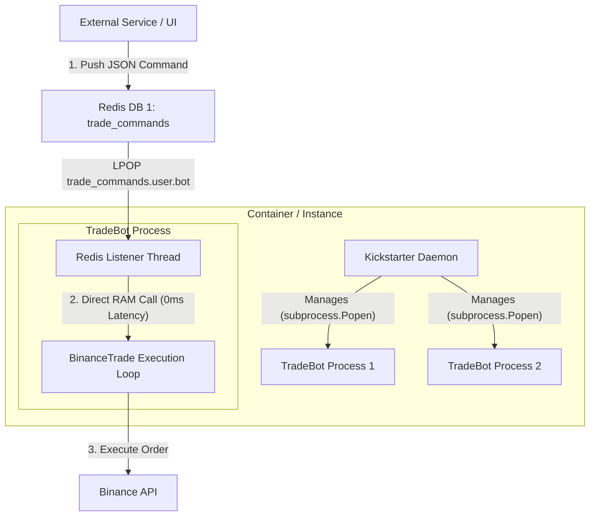

Viewed kickstarter_server.py:1-100
Viewed architecture_analysis.md:1-161
Viewed RL_TradeBot.py:1-100
Viewed RL_TradeBot.py:100-250
Viewed RL_TradeBot.py:251-350
Searched for "ENTRY_NOW"
Viewed BinanceTrade.py:90-150
Searched for "ENTRY_NOW"
Searched for "ENTRY_NOW"
Viewed BinanceTrade.py:405-435
Viewed BinanceTrade.py:625-665

Here is the architectural analysis and the most simple, elegant design recommendations requiring **minimal code changes**.

---

## 1. Architectural Diagnosis of the Current System

Currently, your architecture has two major complexity pain points:

1. **Multi-Bot Process Management (`Kickstarter` + `PM2`)**:
   - **Problem**: Using `PM2` (a Node.js process manager) via a Python wrapper (`PM2.pm2`) forces a **dual-runtime dependency** (Node.js/npm + Python) inside your Docker container. This increases container image size, introduces IPC overhead, and adds failure points.
   - **Cost vs. Complexity**: Keeping multiple bots in a single container is a valid cost-saving strategy (avoids container base memory overhead), but managing them via PM2 is over-engineered.

2. **Manual Buy/Sell Endpoint & File IPC (`ENTRY_NOW.txt`)**:
   - **Problem**: Double indirection. 
     $$\text{External UI} \xrightarrow{\text{Redis Queue}} \text{TradeBot Redis Thread} \xrightarrow{\text{Disk Write}} \text{ENTRY\_NOW.txt} \xrightarrow{\text{10s Polling Timer}} \text{BinanceTrade Loop}$$
   - Storing transient commands in disk text files ([ENTRY_NOW.txt](file:///Users/hamiltonwang/MyCode/AIHedge/diewalkure/Trade/Binance/BinanceTrade.py#L412)) introduces disk I/O latency, state file leaks in Docker containers, and an artificial **10-second polling delay** before manual orders execute.

---

## 2. Recommended Architecture (Minimal Change & Elegant)



### Recommendation 1: Keep Redis as External Endpoint, Remove Text Files (0ms Latency, Stateless)
- **External Endpoint**: Redis (`trade_commands.{user_id}.{bot_id}`) **is already an excellent external API endpoint**. Any backend service, web dashboard, or CLI script can push a JSON message to Redis to trigger a trade.
- **In-Memory Dispatch**: Instead of writing `ENTRY_NOW.txt` to disk and waiting 10 seconds for `check_xxx_now()`:
  1. `TradeBotService._handle_direct_command()` receives `ExecuteBuy` / `ExecuteSell`.
  2. It directly calls `self.trader.trigger_manual_buy()` or `self.trader.trigger_manual_sell()` in RAM.
  3. `BinanceTrade` immediately runs `step_trade(user_input=True)` or sets a thread-safe in-memory `threading.Event()`.
- **Benefits**:
  - ⚡ **Instant Execution**: 0ms delay (down from 10s timer).
  - 🧹 **100% Stateless**: Eliminates disk file management in [BinanceTrade.py](file:///Users/hamiltonwang/MyCode/AIHedge/diewalkure/Trade/Binance/BinanceTrade.py#L411-L425).

### Recommendation 2: Replace PM2 with Standard Python `subprocess` in Kickstarter
- Keep running multiple TradeBots per container to save container host costs.
- Replace `PM2()` with Python's built-in `subprocess.Popen` in [kickstarter_server.py](file:///Users/hamiltonwang/MyCode/AIHedge/diewalkure/Kickstarter/kickstarter_server.py#L44-L48).
- **Process Registry**: Kickstarter simply maintains a dictionary:
  ```python
  self.running_bots[bot_id] = subprocess.Popen([INTERPRETER, "RL_TradeBot.py", ...])
  ```
  Process status check: `proc.poll() is None`.
- **Benefits**:
  - Removes Node.js and `npm install pm2 -g` from Docker images.
  - 100% pure Python, zero extra dependencies, zero PM2 wrapper bugs.

---

## 3. How to Refactor for In-Memory Manual Signals (Code Blueprint)

Here is how surgical and minimal the change is:

### Step 1: Add direct trigger methods in [BinanceTrade.py](file:///Users/hamiltonwang/MyCode/AIHedge/diewalkure/Trade/Binance/BinanceTrade.py)

```python
# In Trade/Binance/BinanceTrade.py
def trigger_manual_buy(self):
    self.logger.info("[BinanceTrade] Triggering instant manual BUY")
    self.env.exch_env.ds.trade_args["entry_now"] = True
    self.step_trade(user_input=True)

def trigger_manual_sell(self):
    self.logger.info("[BinanceTrade] Triggering instant manual SELL")
    self.env.exch_env.ds.trade_args["exit_now"] = True
    self.step_trade(user_input=True)
```

### Step 2: Call trader methods directly in [RL_TradeBot.py](file:///Users/hamiltonwang/MyCode/AIHedge/diewalkure/RL_TradeBot.py#L310-L324)

```python
# In RL_TradeBot.py -> TradeBotService._handle_direct_command()
elif job_type == RedisJobType.ExecuteBuy:
    self.trader.trigger_manual_buy()
    result = {"Status": "Buy order executed instantly"}

elif job_type == RedisJobType.ExecuteSell:
    self.trader.trigger_manual_sell()
    result = {"Status": "Sell order executed instantly"}
```

---

## Summary Comparison

| Aspect | Current Design | Proposed Design | Benefit |
| :--- | :--- | :--- | :--- |
| **Multi-Bot Runtime** | Kickstarter + Node.js PM2 | Kickstarter + Python `subprocess.Popen` | Eliminates Node.js dependency, saves RAM & image size |
| **External Endpoint** | Redis Queue (`trade_commands`) | Redis Queue (`trade_commands`) | Preserved (already clean and async) |
| **Command Delivery** | Write `ENTRY_NOW.txt` disk file | Direct RAM function call | 0ms execution latency, zero disk I/O |
| **Manual Trade Delay** | Up to 10 seconds (Polling) | Immediate | Real-time market execution |
| **Code Changes Required** | High complexity | ~20-30 lines of diff | Minimal risk and high surgical precision |