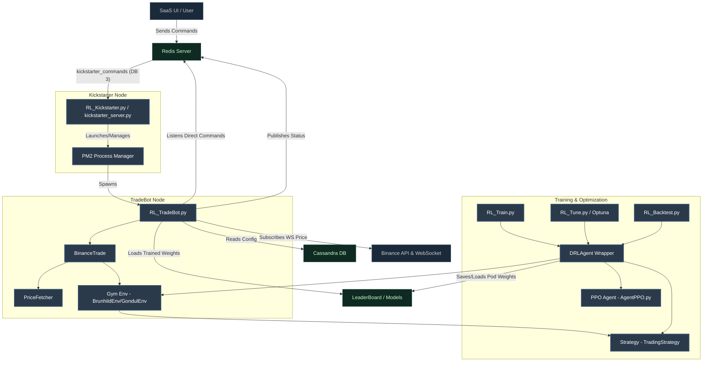

# Diewalkure Codebase Architecture & Structural Review

This document outlines the system architecture, component relationships, core workflows, and design quality of the Diewalkure repository.

---

## 1. System Architecture

The Diewalkure repository is a reinforcement learning (RL) based automated crypto-trading system (primarily Binance). It consists of five major pipelines: **Orchestration (Kickstarter)**, **Live Execution (TradeBot)**, **Training**, **Backtesting**, and **Tuning**.

### 1.1 Architectural Overview Diagram

---

## 2. Core Pipelines & Main Entry Points

### 2.1 Kickstarter (`RL_Kickstarter.py`)
* **Role**: Orchestration, multi-tenant lifecycle management.
* **Flow**:
  1. Starts `kickstarter_server.py`.
  2. Spawns threads to listen on Redis list queue `kickstarter_commands.<bot_id>.<hostname>` (DB 3) and periodically report PM2 process metrics to Redis `tradebot_status` (DB 6).
  3. When a `KickstartTradebot` command is popped, it configures command-line arguments and uses a python-wrapped `PM2` instance to spawn `RL_TradeBot.py` as a subprocess.
  4. When a `StopTradebot` command is popped, it tells `PM2` to kill the subprocess.

### 2.2 TradeBot (`RL_TradeBot.py`)
* **Role**: Live/Simulation trade execution.
* **Flow**:
  1. Parses arguments, resolves env settings, and loads bot parameters from Cassandra DB (for `SaasEnv.API` mode).
  2. Instantiates `PriceFetcher` (for WebSocket price ingestion) and `BinanceTrade`.
  3. Runs a background listener thread for direct controls (e.g. manually force buy/sell, reset trade cash, fetch cash metrics) and WebSocket price events.
  4. Starts the `BinanceTrade` execution loop in a separate thread. This loop step-evaluates the environment and places orders using the Binance API (`BinanceOrder.py`).
  5. Inter-process communication (IPC) uses simple state flags written to local files (e.g., `ENTRY_NOW.txt`, `EXIT_NOW.txt`).

### 2.3 Training (`RL_Train.py`)
* **Role**: Reinforcement learning model training.
* **Flow**:
  1. Loads command-line hyperparameters (`hyper_args.yml`) and technical configurations.
  2. Instantiates `DRLAgent`, which wraps the Gym Environment (`envs/BrunhildEnv_v11.py`) and the signal Strategy (e.g. `double_kf`, `rsi_macd`).
  3. Injects a `DummyOrder` client to simulate paper trading without executing live trades.
  4. Runs `train_and_evaluate` or `train_and_evaluate_mp` using the PPO algorithm (`agents/AgentPPO.py`) to generate policy checkpoints inside a model directory (e.g., `pod_000000`).

### 2.4 Backtesting (`RL_Backtest.py`)
* **Role**: Backtest trained models on historical data.
* **Flow**:
  1. Instantiates `DRLAgent` with `DummyOrder`.
  2. Restores the PPO neural network weights from a trained `pod_dir`.
  3. Steps through the historical environment to collect trajectory logs, cash balances, and positions.
  4. Invokes the strategy-specific plotter function (e.g., `plot_sim` from `TradingStrategy/double_kf/Strategy.py`) to draw performance charts.

---

## 3. Structural Review: Goods and Bads

### 3.1 Architectural Strengths (Goods)
* **Pipeline Separation**: Clear separation between training, backtesting, hyperparameter optimization, and execution.
* **Dynamic Multi-Bot Orchestration**: The Kickstarter + PM2 approach is highly scalable and allows hosting multiple trading bot instances dynamically inside containerized hosts.
* **Structured Settings Injection**: Arguments and technical indicators are grouped cleanly in `tech_args/` and `trade_args/` JSON files, easing configuration management.
* **Optuna Tuning Integration**: Automated hyperparameter searching in `RL_Tune.py` optimizes both RL parameters (net dimensions, learning rate, GAE constants) and signal processing parameters concurrently.

### 3.2 Severe Architectural Weaknesses & Risks (Bads)

#### 1. Dead & Orphaned Code (High Technical Debt)
The repository contains large quantities of code inherited from FinRL or older experiments that are never imported or executed:
* **The Entire `meta/` Directory**: Contains Yahoo Finance, JoinQuant, QuantConnect, WRDS, and CCXT data processors. None of these are used; only the custom preprocessor in `preprocessor/` and live data catchup scripts are active.
* **Unused Trading Integrations**: `Trade/Alpaca` contains code for stock trading via Alpaca API. The codebase only supports Binance for live execution.
* **Unused Kafka Integration**: `app/consumer` and `app/producer` contain Kafka consumer/producer classes that are completely orphaned.
* **Orphaned Strategies & Environments**:
  * `TradingStrategy/Hema_v3` and `TradingStrategy/SqueezeMomentum_v4` are completely unreferenced in the strategy loading utility (`train/utils.py`).
  * `TradingStrategy/double_ukf` is missing its strategy and trade argument setups in `train/utils.py`, though it has a plotter.
  * `envs/CryptoEnv_v1.py`, `envs/StockTradingEnv_v1.py`, and `envs/env_stocktrading_stoploss.py` are dead wrappers.
  * `agents/AgentPPO_H.py`, `agents/AgentPPO_035.py`, and `agents/AgentBase_035.py` are unused.
  * `app/scipy_helper.py` is unused.

#### 2. Duplicate Module Naming Conflict [RESOLVED]
* The directory `RedisClient/` previously contained both `redis_client.py` and `RedisClient.py` causing potential case-insensitivity issues.
* **Resolution**: Consolidated all features (reconnection logic, circuit breaker, system metrics, and heartbeat) into [redis_client.py](file:///Users/hamiltonwang/MyCode/AIHedge/diewalkure/RedisClient/redis_client.py), added dynamic defaults for `hostname` and `instance_id` to prevent crashes when called with different parameters, and removed `RedisClient.py`. All imports have been updated to lowercase.

#### 3. Broken Test Suites [RESOLVED]
* The test file `tests/SocketServer/test_start_stop_bot.py` attempted to import non-existent modules `SocketClient` and `SocketServer`.
* **Resolution**: Safely deleted the broken `test_start_stop_bot.py` file.

#### 4. File-Based Inter-Process Communication (IPC)
* `RL_TradeBot.py` uses text files like `ENTRY_NOW.txt` and `EXIT_NOW.txt` to trigger order placement. In containerized (Docker/K8s) environments, relying on shared file states is extremely fragile and prone to latency/sync errors. A message broker or Redis state key should be used instead.

#### 5. Stale Documentation [RESOLVED]
* `README_Execute.md` previously instructed running the non-existent `TradeBot.py`.
* **Resolution**: Updated [README_Execute.md](file:///Users/hamiltonwang/MyCode/AIHedge/diewalkure/README_Execute.md) to reference [RL_TradeBot.py](file:///Users/hamiltonwang/MyCode/AIHedge/diewalkure/RL_TradeBot.py).

---

## 4. Production Clean-up & Refactoring Recommendations

1. **Delete Dead Modules**: Safely prune `meta/`, `Trade/Alpaca/`, `app/consumer/`, `app/producer/`, and unused `.py` files inside `envs/`, `TradingStrategy/`, and `agents/`.
2. **Consolidate Redis Clients**: Merge `RedisClient.py` and `redis_client.py` into a single, well-tested module to prevent filesystem casing conflicts.
3. **Migrate File IPC to Redis**: Replace the file checks for `ENTRY_NOW.txt` and `EXIT_NOW.txt` with Redis keys or in-memory pub-sub channels to make TradeBot stateless and cloud-native.
4. **Fix or Remove SocketServer Tests**: Remove the obsolete socket server tests or rewrite them if a websocket client/server is reintroduced.
5. **Update README Scripts**: Sync `README_Execute.md` command examples with `RL_TradeBot.py`.
