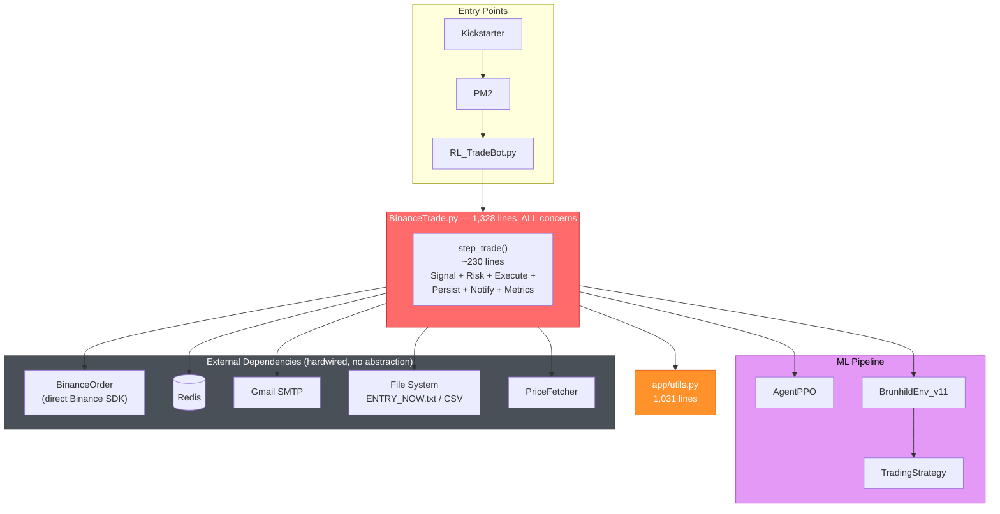
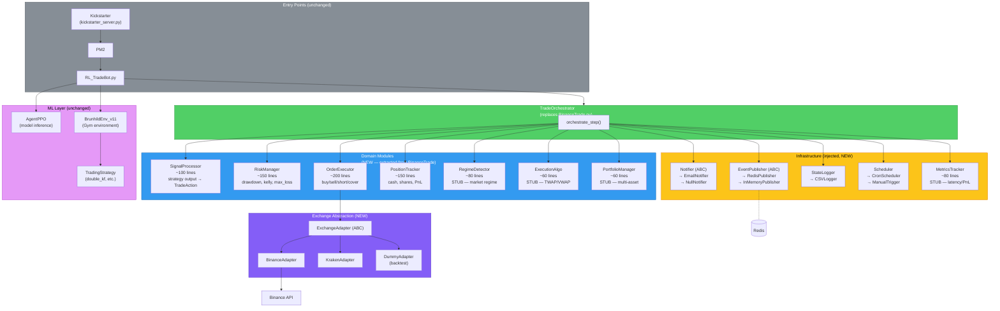
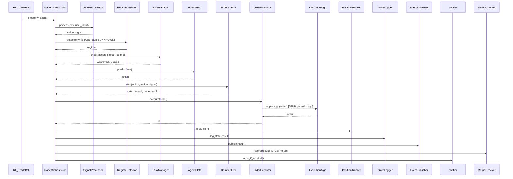
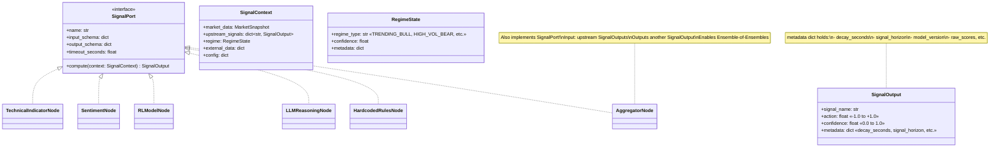
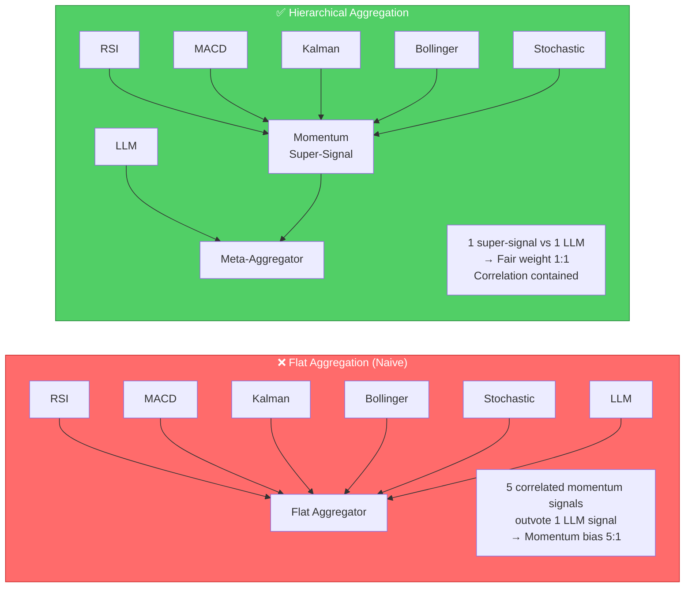
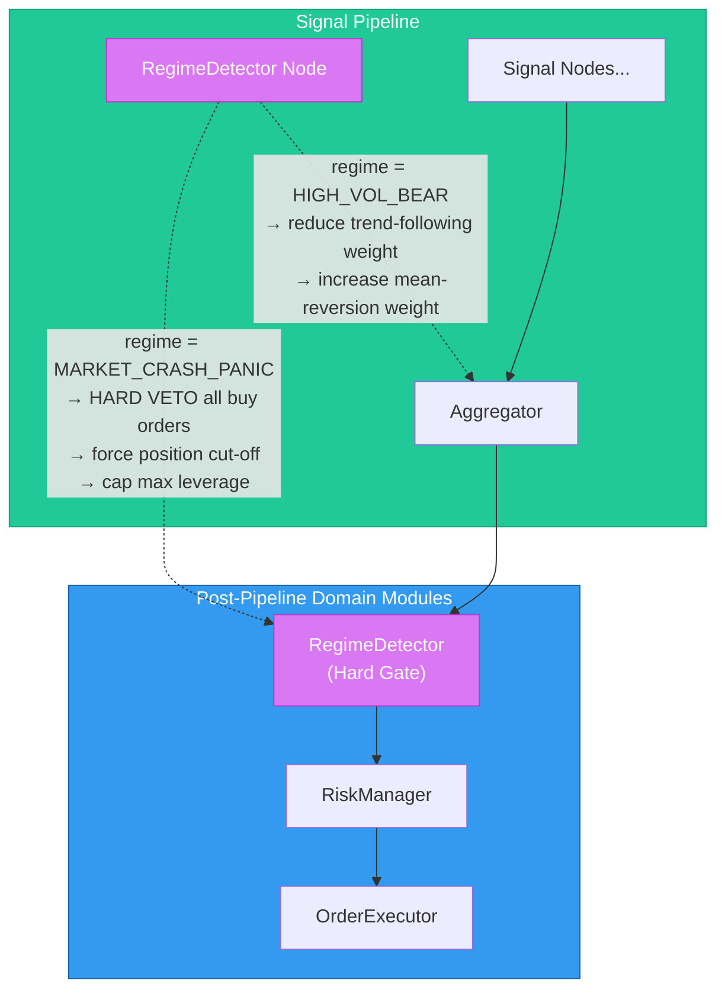
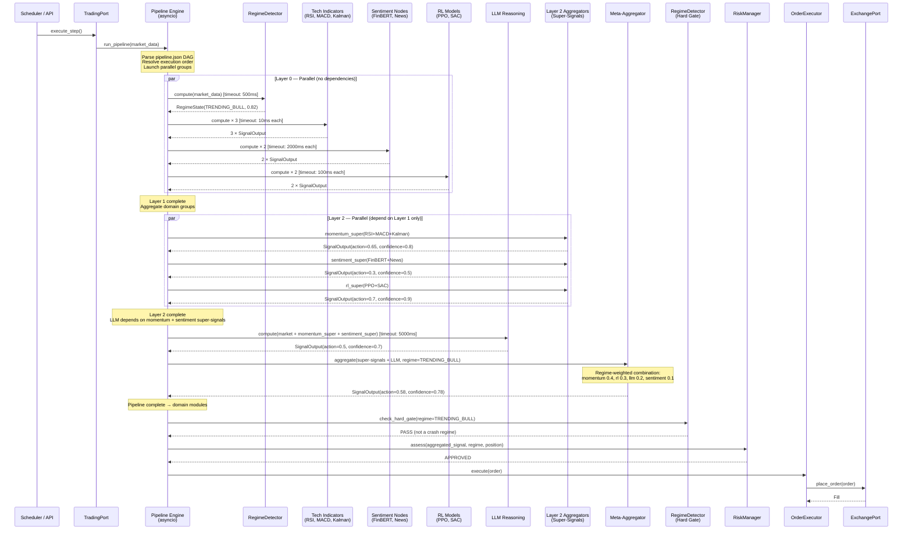
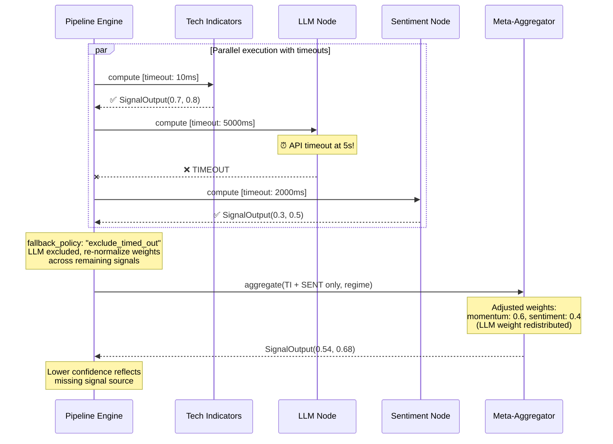

# Architecture Alignment: Current, Option A & Option B Diagrams

This document draws out my understanding of the current architecture and each proposed option so we can verify alignment before proceeding.

---

## 1. Option Current: As-Is Architecture

**What exists today**: A monolithic `BinanceTrade.py` (1,328 lines, 1 class) that handles signal processing, risk checks, order execution, state persistence, notifications, and scheduling — all in a single God Object. Everything is hardwired; no abstractions or ports.

### Current — Architecture Diagram



> [!NOTE]
> **Key characteristic of Current**: Everything flows through `BinanceTrade.step_trade()`. There are no abstractions, no ports, no dependency injection. Swapping any external dependency (exchange, notification, persistence) requires modifying the God Object directly.

---

## 2. Option A: Domain Module Extraction

**Core idea**: Break `BinanceTrade.py` (the God Object) into focused modules. No Meta LLM. The `TradeOrchestrator` replaces `BinanceTrade` as a thin coordinator that delegates to injected modules. Everything still lives in the same process; modules call each other directly via Python method calls.

### Option A — Full Architecture Diagram



### Option A — Data Flow (step-by-step)



> [!IMPORTANT]
> **My understanding of Option A:**
> - It's a **module extraction refactor** — same process, same deployment model
> - `TradeOrchestrator` is a thin coordinator, NOT an intelligent agent
> - The ML pipeline (`AgentPPO` → `BrunhildEnv` → `TradingStrategy`) is **unchanged**
> - New components (`RegimeDetector`, `ExecutionAlgo`, `PortfolioManager`, `MetricsTracker`) are **empty stubs** — they exist as architectural slots but return pass-through / no-op values
> - There is **no Meta LLM** in Option A
> - Exchange interaction goes through an ABC adapter pattern, enabling multi-exchange and paper trading

---

## 3. Option B: Hexagonal + Configurable Signal DAG Pipeline

**Core idea**: Hexagonal (Ports & Adapters) architecture where the domain has **zero external imports**, combined with a **configurable signal DAG pipeline** where all signal sources — technical indicators, sentiment, RL, LLM, CNN, LSTM, hardcoded rules — are equal, pluggable `SignalPort` nodes. The pipeline topology is defined by a JSON/schema config, not by code structure.

### Key Design Decisions (Resolved)

| Decision | Resolution |
|----------|------------|
| **SignalOutput contract** | `action: -1.0 to 1.0`, `confidence: 0.0 to 1.0`. Extended fields (`decay_seconds`, `signal_horizon`) go in a `metadata: dict`. Industry-compliant. |
| **Aggregation strategy** | **Hierarchical Multi-Layer** (Ensemble of Ensembles). Related signals → Domain Super-Signals → Meta-Aggregator. Prevents correlated signals from outvoting independent ones. |
| **DAG execution model** | **Parallel async** (`asyncio` / `ThreadPoolExecutor`). Independent nodes run concurrently. Each node has a `timeout_seconds`. Timed-out nodes are gracefully excluded from aggregation. |
| **RegimeDetector placement** | **Dual role**: (1) Inside pipeline as a context provider feeding dynamic weights to the Aggregator, AND (2) After pipeline as a hard risk gate / circuit breaker in the RiskManager. |
| **Production safety** | 6 production-grade components added: `EmergencyCircuitBreaker`, `StateReconciler`, `DataSanitizer`, `TCAEstimator`, `ClockPort`, `FeatureStore`. |
| **Exchange connectivity** | **Adopt OSS**: NautilusTrader (default, Rust/Python, production-grade CEX connectors), Uniswap (DEX), Ondo Finance (RWA). Wrap behind `ExchangePort` interface. Eliminates ~1,000+ lines of fragile hand-rolled REST/WS code. |

### Option B — Architecture Diagram

```mermaid
graph TB
    subgraph Drivers["Driving Adapters (Input Side)"]
        direction TB
        CLI["CLI / Scheduler"]
        API["REST/gRPC API"]
        REDIS_IN["Redis Command Listener"]
    end

    subgraph Domain["Domain Layer (Pure Python — zero external imports)"]
        direction TB

        subgraph Ports_In["Input Ports"]
            TP["TradingPort"]
        end

        subgraph DataLayer["Data Ingestion Layer"]
            direction TB
            DS["🧹 DataSanitizer<br/>• Stale quote detection<br/>• Spike / outlier filtering<br/>• Bar construction (tick→OHLCV)"]
            FS["🧠 FeatureStore<br/>• Rolling averages cache<br/>• Shared computed features<br/>• Cross-node feature reuse"]
        end

        subgraph SignalPipeline["Signal Pipeline Engine<br/>(async DAG — configured via JSON/schema)"]
            direction TB

            subgraph RegimeNode["Regime Context"]
                RD_NODE["RegimeDetector Node<br/>(HMM, rule-based, etc.)<br/>Output: regime + context"]
            end

            subgraph Layer1["Layer 1: Raw Signal Nodes<br/>(all implement SignalPort, run in parallel)"]
                direction TB
                TI_1["Tech Indicator: RSI"]
                TI_2["Tech Indicator: MACD"]
                TI_3["Tech Indicator: Kalman"]
                SENT_1["Sentiment: FinBERT"]
                SENT_2["Sentiment: News NLP"]
                RL_1["RL Model: PPO"]
                RL_2["RL Model: SAC"]
                CNN_1["CNN / LSTM"]
                LLM_1["LLM Reasoning"]
                HARD_1["Hardcoded Rules"]
            end

            subgraph Layer2["Layer 2: Domain Super-Signal Aggregators<br/>(group correlated signals)"]
                direction TB
                AGG_MOMENTUM["Momentum Super-Signal<br/>(RSI + MACD + Kalman)"]
                AGG_SENTIMENT["Sentiment Super-Signal<br/>(FinBERT + News NLP)"]
                AGG_RL["RL Super-Signal<br/>(PPO + SAC)"]
            end

            subgraph Layer3["Layer 3: Meta-Aggregator"]
                META["Meta-Aggregator<br/>───────────<br/>Combines super-signals.<br/>Weights adjusted by RegimeDetector.<br/>Can be: Mean-Variance Optimizer,<br/>LLM Reasoner, Risk-Weighted Stacking,<br/>or simple weighted vote"]
            end

            RD_NODE -.->|regime context| META
            TI_1 --> AGG_MOMENTUM
            TI_2 --> AGG_MOMENTUM
            TI_3 --> AGG_MOMENTUM
            SENT_1 --> AGG_SENTIMENT
            SENT_2 --> AGG_SENTIMENT
            RL_1 --> AGG_RL
            RL_2 --> AGG_RL
            CNN_1 --> META
            LLM_1 --> META
            HARD_1 --> META
            AGG_MOMENTUM --> META
            AGG_SENTIMENT --> META
            AGG_RL --> META
        end

        subgraph DomainModules["Domain Modules (post-pipeline gating)"]
            direction TB
            RD_GATE["RegimeDetector<br/>(hard risk gate / circuit breaker)"]
            TCA["💸 TCAEstimator<br/>• Maker/taker fees<br/>• Funding rate costs<br/>• Slippage vs. book depth"]
            RM["RiskManager<br/>(drawdown, kelly, position limits)"]
            OE["OrderExecutor"]
            PT["PositionTracker"]
            PMG["PortfolioManager"]
            EXA["ExecutionAlgo<br/>(TWAP / VWAP)"]
        end

        subgraph SafetyLayer["Safety & State Integrity"]
            direction TB
            ECB["🚨 EmergencyCircuitBreaker<br/>• WS disconnect > N sec<br/>• Daily loss > hard threshold<br/>• Exchange 5xx errors<br/>→ Cancel all, flatten, halt"]
            SR["🔄 StateReconciler<br/>• Startup sync<br/>• Reconnect sync<br/>• Local vs exchange state<br/>• Partial fill resolution"]
        end

        subgraph Ports_Out["Output Ports"]
            EP_PORT["ExchangePort"]
            NP["NotificationPort"]
            PP["PersistencePort"]
            EVP["EventPort"]
            MP["MetricsPort"]
            CP["⏰ ClockPort<br/>• Live: system/NTP clock<br/>• Backtest: stepped time"]
        end

        TP --> DS
        DS --> FS
        FS --> SignalPipeline
        META --> RD_GATE
        RD_NODE -.->|regime for hard veto| RD_GATE
        RD_GATE --> TCA
        TCA --> RM
        RM --> OE
        OE --> EXA
        EXA --> EP_PORT
        OE --> PT
        PT --> PMG
        OE --> NP
        OE --> PP
        OE --> EVP
        OE --> MP
        ECB -.->|hard kill / cancel all| OE
        ECB -.->|hard kill / cancel all| EP_PORT
        SR -.->|startup & reconnect sync| PT
        SR -.->|verify against exchange| EP_PORT
    end

    subgraph DrivenAdapters["Driven Adapters (Output Side)"]
        direction TB

        subgraph ExchangeAdapters["Exchange Adapters<br/>(via ExchangePort)"]
            direction TB
            NAUT["NautilusTrader Adapter<br/>(default — Rust/Python)<br/>• Binance, OKX, Bybit, etc.<br/>• Pre-built WS reconnect<br/>• Rate-limit management"]
            PAPER_A["PaperTradingAdapter<br/>• Simulated fills<br/>• No real capital"]
            UNI["Uniswap Adapter<br/>(DEX — on-chain)<br/>• ERC-20 swaps<br/>• Liquidity pool routing"]
            ONDO["Ondo Finance Adapter<br/>(RWA — tokenized assets)<br/>• US Treasuries (USDY/OUSG)<br/>• Tokenized real-world assets"]
        end

        EMAIL_A["EmailAdapter"]
        REDIS_A["RedisEventAdapter"]
        CSV_A["CSVAdapter"]
        PROM_A["PrometheusAdapter"]
        LIVE_CLK["LiveClockAdapter<br/>(NTP / system)"]
        BT_CLK["BacktestClockAdapter<br/>(deterministic step)"]
    end

    subgraph DataSources["External Data Sources"]
        direction TB
        MARKET["Market Data API<br/>(WS + REST)"]
        NEWS["News / Social Feeds"]
        MODEL_EP["Model Serving Endpoint"]
    end

    CLI --> TP
    API --> TP
    REDIS_IN --> TP
    EP_PORT --> NAUT
    EP_PORT --> PAPER_A
    EP_PORT --> UNI
    EP_PORT --> ONDO
    NP --> EMAIL_A
    EVP --> REDIS_A
    PP --> CSV_A
    MP --> PROM_A
    CP --> LIVE_CLK
    CP --> BT_CLK

    DS -.- MARKET
    SENT_1 -.- NEWS
    RL_1 -.- MODEL_EP
    LLM_1 -.- MODEL_EP

    style Domain fill:#228be6,stroke:#1864ab,color:#fff
    style DataLayer fill:#74c0fc,stroke:#1864ab,color:#000
    style SignalPipeline fill:#20c997,stroke:#0ca678,color:#fff
    style Layer1 fill:#38d9a9,stroke:#0ca678,color:#000
    style Layer2 fill:#69db7c,stroke:#2b8a3e,color:#000
    style Layer3 fill:#ffd43b,stroke:#e67700,color:#000
    style DomainModules fill:#339af0,stroke:#1864ab,color:#fff
    style SafetyLayer fill:#ff6b6b,stroke:#c92a2a,color:#fff
    style DrivenAdapters fill:#fcc419,stroke:#e67700,color:#000
    style DataSources fill:#868e96,stroke:#495057,color:#fff
    style META fill:#ff6b6b,stroke:#c92a2a,color:#fff
    style RD_NODE fill:#da77f2,stroke:#ae3ec9,color:#fff
    style RD_GATE fill:#da77f2,stroke:#ae3ec9,color:#fff
    style RegimeNode fill:#e599f7,stroke:#ae3ec9,color:#000
    style ExchangeAdapters fill:#fab005,stroke:#e67700,color:#000
    style ECB fill:#e03131,stroke:#c92a2a,color:#fff
    style SR fill:#f08c00,stroke:#e67700,color:#fff
    style TCA fill:#f783ac,stroke:#c2255c,color:#000
```



### Option B — Production Component Reference

| Component | Role | Where in Architecture | Triggers / Inputs | Output / Actions |
|-----------|------|----------------------|-------------------|------------------|
| 🚨 **EmergencyCircuitBreaker** | Global panic / hard kill-switch | Safety Layer (cross-cutting, can override OrderExecutor + ExchangePort) | WS disconnect > N sec, daily loss > hard threshold, exchange 5xx errors | Cancel all open orders, flatten all positions (market sell/cover), halt bot, lock until human reset |
| 🔄 **StateReconciler** | Position & order reconciliation | Safety Layer → PositionTracker + ExchangePort | Bot startup, network reconnect, periodic heartbeat | Compare local state vs exchange ground-truth, resolve partial fills, reconcile discrepancies |
| 🧹 **DataSanitizer** | Market data cleaning | Data Layer (pre-pipeline) | Raw WS/REST market data | Stale quote rejection, spike/outlier filtering, deterministic bar construction (tick→OHLCV) |
| 💸 **TCAEstimator** | Transaction cost & slippage estimation | Domain Modules (between RegimeDetector gate and RiskManager) | Proposed order + order book depth | Net profitability check: if signal expects +0.15% but costs are 0.18%, veto the trade |
| ⏰ **ClockPort** | Pluggable time provider | Output Port (used by all domain services) | N/A (dependency injected) | `LiveClockAdapter` returns NTP/system time; `BacktestClockAdapter` returns stepped deterministic time |
| 🧠 **FeatureStore** | Rolling state buffer / feature cache | Data Layer (post-sanitizer, pre-pipeline) | Sanitized market data | Cached rolling averages, volatility, order book imbalance — shared across all SignalPort nodes |

### Option B — The Signal Node Contract

Every signal source implements the same `SignalPort` interface. **AggregatorNodes also implement SignalPort**, enabling hierarchical composition (aggregators can take other aggregators as inputs).



### Option B — Hierarchical Aggregation (Ensemble of Ensembles)

The reason for hierarchical aggregation: **signal correlation control**.



### Option B — RegimeDetector Dual Role



> **Dual role summary**:
> - **Inside pipeline** (context provider): RegimeDetector feeds the current market regime to the Aggregator, which dynamically adjusts signal weights. In a choppy market, trend-following signals are downweighted; mean-reversion signals are upweighted.
> - **After pipeline** (circuit breaker): The same regime output feeds the post-pipeline RiskManager as a hard gate. In extreme regimes (crash, flash crash, black swan), the RiskManager can veto all trades regardless of how positive the aggregated alpha signal is.

### Option B — Example Pipeline Config (JSON)

```json
{
  "pipeline": {
    "nodes": [
      {
        "id": "regime_detector",
        "type": "regime",
        "config": { "method": "hmm", "n_states": 4 },
        "inputs": ["market_data"],
        "timeout_seconds": 0.5
      },
      {
        "id": "tech_rsi",
        "type": "technical_indicator",
        "config": { "indicator": "rsi", "period": 14 },
        "inputs": ["market_data"],
        "timeout_seconds": 0.01
      },
      {
        "id": "tech_macd",
        "type": "technical_indicator",
        "config": { "indicator": "macd" },
        "inputs": ["market_data"],
        "timeout_seconds": 0.01
      },
      {
        "id": "tech_kalman",
        "type": "technical_indicator",
        "config": { "strategy": "double_kf", "params_file": "tech_args/double_kf.json" },
        "inputs": ["market_data"],
        "timeout_seconds": 0.01
      },
      {
        "id": "sentiment_finbert",
        "type": "sentiment",
        "config": { "model": "finbert" },
        "inputs": ["external:news_feed"],
        "timeout_seconds": 2.0
      },
      {
        "id": "sentiment_news",
        "type": "sentiment",
        "config": { "provider": "newsapi" },
        "inputs": ["external:news_feed"],
        "timeout_seconds": 2.0
      },
      {
        "id": "rl_ppo",
        "type": "rl_model",
        "config": { "model_path": "pod_000042/", "agent": "ppo" },
        "inputs": ["market_data"],
        "timeout_seconds": 0.1
      },
      {
        "id": "rl_sac",
        "type": "rl_model",
        "config": { "model_path": "pod_000099/", "agent": "sac" },
        "inputs": ["market_data"],
        "timeout_seconds": 0.1
      },
      {
        "id": "llm_reasoning",
        "type": "llm",
        "config": { "model": "gemini-2.0-flash", "prompt_template": "market_analysis_v2" },
        "inputs": ["market_data", "upstream:momentum_super", "upstream:sentiment_super"],
        "timeout_seconds": 5.0
      },
      {
        "id": "momentum_super",
        "type": "aggregator",
        "config": { "method": "equal_weight" },
        "inputs": ["upstream:tech_rsi", "upstream:tech_macd", "upstream:tech_kalman"]
      },
      {
        "id": "sentiment_super",
        "type": "aggregator",
        "config": { "method": "confidence_weighted" },
        "inputs": ["upstream:sentiment_finbert", "upstream:sentiment_news"]
      },
      {
        "id": "rl_super",
        "type": "aggregator",
        "config": { "method": "best_confidence" },
        "inputs": ["upstream:rl_ppo", "upstream:rl_sac"]
      },
      {
        "id": "meta_aggregator",
        "type": "aggregator",
        "config": {
          "method": "regime_weighted",
          "regime_source": "regime_detector",
          "regime_weights": {
            "TRENDING_BULL":    { "momentum_super": 0.4, "rl_super": 0.3, "llm_reasoning": 0.2, "sentiment_super": 0.1 },
            "HIGH_VOL_BEAR":    { "momentum_super": 0.1, "rl_super": 0.2, "llm_reasoning": 0.4, "sentiment_super": 0.3 },
            "RANGING_CHOPPY":   { "momentum_super": 0.2, "rl_super": 0.4, "llm_reasoning": 0.2, "sentiment_super": 0.2 },
            "MARKET_CRASH":     { "momentum_super": 0.0, "rl_super": 0.0, "llm_reasoning": 0.5, "sentiment_super": 0.5 }
          }
        },
        "inputs": ["upstream:momentum_super", "upstream:sentiment_super", "upstream:rl_super", "upstream:llm_reasoning"]
      }
    ],
    "output_node": "meta_aggregator",
    "regime_node": "regime_detector",
    "fallback_policy": "exclude_timed_out"
  }
}
```

### Option B — Data Flow (Parallel + Timeout + Hierarchical)



### Option B — Graceful Degradation on Timeout



---

## Critical Evaluation

### Is this naive or ambitious?

**Neither. This is how professional quant firms structure their systems.** Here's the alignment:

| Your B Concept | Professional Quant Equivalent |
|---|---|
| Signal Nodes (pluggable black boxes) | **"Alphas"** — independent signal generators at firms like Two Sigma, Citadel, DE Shaw |
| Hierarchical Aggregation (Ensemble of Ensembles) | **Alpha combination layer** — group correlated alphas, then combine uncorrelated groups |
| JSON-configured DAG pipeline | **Workflow engines / DAG orchestrators** (Airflow, Prefect, or proprietary systems) |
| RegimeDetector (dual role) | **Regime-conditional models** — standard practice at macro/systematic funds |
| Domain Modules (Risk → Execute) | **Risk management → Execution management system (EMS)** — always separate from alpha |
| SignalPort interface (input/output contract) | **Feature store + standardized signal API** — every alpha returns a score with confidence |
| Graceful degradation on timeout | **Circuit breakers + fallback** — production-grade alpha systems handle partial failures |
| NautilusTrader / OSS exchange adapters | **Standard practice** — firms wrap CCXT, QuickFIX, or NautilusTrader behind their own port interface. Nobody hand-rolls exchange connectivity |

### Where it gets hard (honest assessment)

| Challenge | Severity | Mitigation |
|-----------|----------|------------|
| **DAG execution engine** | 🟡 Medium | Build a simple async one (~400 lines with timeout handling), or adopt Prefect/LangGraph |
| **Latency budget** | 🟡 Medium | Parallel execution + per-node timeouts keep it bounded. Fine for ≥15min candles |
| **Testing signal combinations** | 🟠 Medium-High | Disciplined backtesting per config. Version-control pipeline.json alongside code |
| **Config complexity** | 🟡 Medium | JSON schema validation + config diffing. Treat pipeline.json like infrastructure-as-code |
| **Overfitting risk** | 🟠 Medium-High | Hierarchical aggregation helps (correlated signals can't outvote). Still need IC/IR testing per signal |
| **Signal correlation** | 🟡 Medium | Hierarchical grouping is the correct mitigation. Monitor cross-signal correlation in production |

---

## Summary Comparison

| Aspect | Current | Option A | **Option B** |
|--------|---------|----------|--------------|
| **Architecture** | God Object | Module extraction | **Hexagonal + Signal DAG** |
| **Signal sources** | 1 (hardcoded in `step_trade()`) | 1 (extracted to module) | **N (any, pluggable via JSON)** |
| **Aggregation** | None | None | **Hierarchical (Ensemble of Ensembles)** |
| **Pipeline config** | None | None | **JSON/schema DAG** |
| **Execution model** | Sequential, single-threaded | Sequential | **Parallel async + per-node timeouts** |
| **Regime awareness** | None | Stub | **Dual: pipeline context + hard gate** |
| **LLM / new model** | N/A | N/A | **Just another SignalPort node** |
| **Adding new model** | Edit God Object | Add module | **Implement SignalPort + add config entry** |
| **Domain purity** | None | Partial | **Full (zero external imports)** |
| **Graceful degradation** | None | None | **Timeout → exclude + re-weight** |
| **Data sanitization** | None | None | **DataSanitizer (spike filter, stale check, bar construction)** |
| **Feature caching** | Recompute each step | Recompute each step | **FeatureStore (shared rolling cache)** |
| **Cost estimation** | None | None | **TCAEstimator (fees + slippage pre-check)** |
| **Emergency safety** | None | None | **EmergencyCircuitBreaker (cancel all, flatten, halt)** |
| **State reconciliation** | None | None | **StateReconciler (local vs exchange sync)** |
| **Deterministic backtest** | Partial (time-coupled) | Partial | **ClockPort (pluggable live/backtest time)** |
| **Exchange connectivity** | Hand-rolled Binance REST/WS | Hand-rolled (extracted) | **NautilusTrader (CEX) + Uniswap (DEX) + Ondo (RWA)** |
| **Effort** | 0 (status quo) | ~1-2 weeks | **~7-10 weeks** (reduced: OSS saves ~1-2 weeks on exchange code) |
| **Prop firm alignment** | ❌ | ⚠️ Partial | **✅ Full** |

