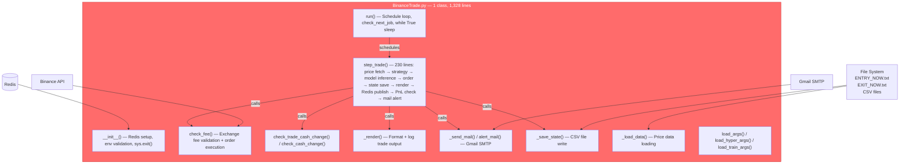
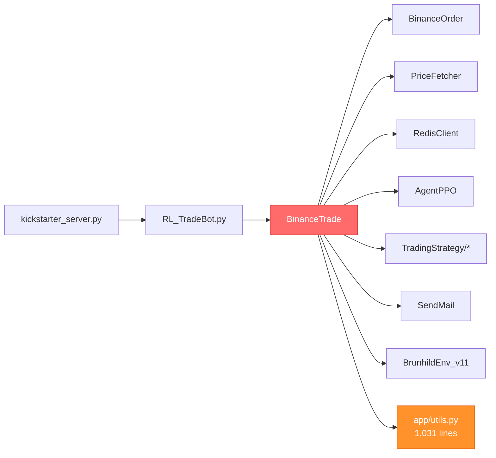
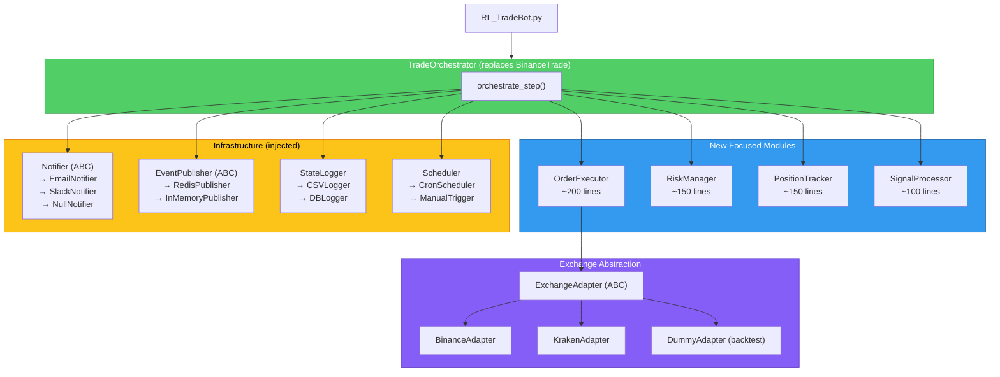
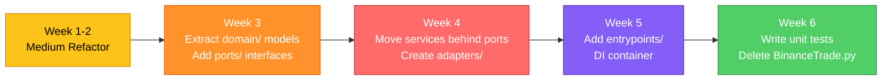

# Architecture Refactoring: God Object Decomposition

## 📍 Current Architecture ("Before")

### What `BinanceTrade.py` Does Today (1,328 lines, 1 class)



### Key Problems in the Current Design

| Problem | Where | Impact |
|---------|-------|--------|
| **Strategy + Execution coupled** | `step_trade()` lines 736-967 | Can't test strategy logic without a live exchange |
| **Redis awareness everywhere** | `__init__`, `step_trade`, response publishing | Can't run without Redis, even for backtesting |
| **Mail inside trade logic** | `step_trade()` → `alert_mail()` | Trade method has side effects you can't control |
| **File I/O for signals** | `ENTRY_NOW.txt`, `EXIT_NOW.txt` | Race conditions, no atomicity |
| **Scheduling baked in** | `run()` with `schedule` library | Can't trigger trades programmatically |
| **No exchange abstraction** | `BinanceOrder` called directly | Adding Kraken = copy-paste 1,328 lines |
| **Config loading in trade class** | `load_args()`, `load_train_args()` | Trade class knows about training config |

### Current Dependency Graph (simplified)



---

## 🟡 Option A: Medium Disruption — Domain Module Extraction

**Effort**: ~1-2 weeks | **Risk**: Moderate | **Payoff**: Testable + multi-exchange ready

### Architecture After Refactoring



### Concrete File Changes

#### New Files Created

| New File | Lines (est.) | Extracted From | Responsibility |
|----------|-------------|----------------|----------------|
| `Trade/order_executor.py` | ~200 | `step_trade()` L818-967 | Execute buy/sell/short/cover via exchange adapter, handle partial fills |
| `Trade/risk_manager.py` | ~150 | `step_trade()` L893-911 | Check `done_total_loss`, `done_drawdown`, `done_kelly`, position limits |
| `Trade/position_tracker.py` | ~150 | `check_trade_cash_change()`, `check_cash_change()` | Track cash, shares, PnL, reconcile on restart |
| `Trade/signal_processor.py` | ~100 | `step_trade()` L751-764, `check_xxx_now()` | Process strategy output → `TradeAction` |
| `Trade/exchange_adapter.py` | ~60 | New ABC | `place_order()`, `get_balance()`, `get_fee()`, `cancel_order()` |
| `Trade/Binance/binance_adapter.py` | ~150 | `BinanceOrder` wrapper | Implements `ExchangeAdapter` for Binance |
| `Trade/notifier.py` | ~80 | `_send_mail()`, `alert_mail()` | ABC with `EmailNotifier`, `NullNotifier` |
| `Trade/event_publisher.py` | ~80 | Redis rpush/expire blocks | ABC with `RedisPublisher`, `InMemoryPublisher` |
| `Trade/state_logger.py` | ~60 | `_save_state()`, `_render()` | Write state CSV, format trade logs |
| `Trade/trade_orchestrator.py` | ~250 | Remaining `BinanceTrade` skeleton | Wire modules together, own the `step()` loop |

#### Existing Files Modified

| File | Change |
|------|--------|
| [BinanceTrade.py](file:///Users/hamiltonwang/MyCode/AIHedge/diewalkure/Trade/Binance/BinanceTrade.py) | Gutted → becomes `BinanceAdapter` or deleted |
| [RL_TradeBot.py](file:///Users/hamiltonwang/MyCode/AIHedge/diewalkure/RL_TradeBot.py) | Imports `TradeOrchestrator` instead of `BinanceTrade` |
| [kickstarter_server.py](file:///Users/hamiltonwang/MyCode/AIHedge/diewalkure/Kickstarter/kickstarter_server.py) | Minor import path changes |

#### How `step_trade()` Looks After

```python
# Trade/trade_orchestrator.py (~250 lines total)
class TradeOrchestrator:
    def __init__(self, exchange: ExchangeAdapter, risk: RiskManager,
                 signal: SignalProcessor, notifier: Notifier,
                 publisher: EventPublisher, state_logger: StateLogger):
        self.exchange = exchange
        self.risk = risk
        self.signal = signal
        self.notifier = notifier
        self.publisher = publisher
        self.state_logger = state_logger

    def step(self, env, agent, user_input=False) -> dict:
        # 1. Get price + signal
        action_signal = self.signal.process(env, user_input)

        # 2. Risk check (can veto the trade)
        action_signal = self.risk.check(action_signal, env)

        # 3. Model inference (if not user-driven)
        action = agent.predict(env) if not user_input else np.zeros(env.action_dim)

        # 4. Execute via exchange adapter
        state, reward, done, result = env.step(action, action_signal)

        # 5. Log + notify (fire-and-forget, no trade logic dependency)
        self.state_logger.log(state, result)
        self.publisher.publish(result)
        if self.risk.should_alert(env):
            self.notifier.alert(self.risk.alert_message)

        return result
```

### What This Enables

- ✅ **Unit test** `RiskManager` with fake position data — no Redis, no Binance
- ✅ **Add Kraken**: implement `KrakenAdapter` (~150 lines) → plug into `TradeOrchestrator`
- ✅ **Backtest without side effects**: inject `DummyAdapter` + `NullNotifier` + `InMemoryPublisher`
- ✅ **Each module < 250 lines** — easy to review, easy to own

---

## 🔴 Option B: High Disruption — Hexagonal (Ports & Adapters) Architecture

**Effort**: ~3-6 weeks | **Risk**: High (needs tests first) | **Payoff**: Production-grade, SaaS-ready

### Core Principle

The domain (trade logic) has **zero imports** from infrastructure (Redis, Binance SDK, file I/O, email). All I/O crosses a boundary through **ports** (interfaces) and **adapters** (implementations). The domain is a pure Python library that can be tested with zero external dependencies.

### Architecture Diagram

```mermaid
graph TB
    subgraph Drivers["Driving Adapters (Input)"]
        direction TB
        CLI["CLI Entry Point\nRL_TradeBot.py"]
        API["REST/gRPC API\n(future SaaS)"]
        SCHED["Scheduler Adapter\nCron / Manual"]
        REDIS_IN["Redis Command Listener"]
    end

    subgraph Domain["Domain Layer (Pure Python, NO external imports)"]
        direction TB

        subgraph Ports_In["Input Ports (ABCs)"]
            TP["TradingPort"]
            CP["CommandPort"]
        end

        subgraph Core["Core Domain"]
            TO["TradeOrchestrator"]
            OE["OrderExecutor"]
            RM["RiskManager"]
            PT["PositionTracker"]
            SP["SignalProcessor"]
            PM["PortfolioManager"]
        end

        subgraph DomainModels["Domain Models (dataclasses)"]
            ORD["Order\namount, side, symbol\nidempotency_key"]
            POS["Position\nentry_price, qty, pnl"]
            SIG["Signal\naction, confidence, source"]
            RISK["RiskAssessment\ndrawdown, kelly, max_loss"]
            FILL["Fill\nprice, qty, fee, timestamp"]
        end

        subgraph Ports_Out["Output Ports (ABCs)"]
            EP_PORT["ExchangePort"]
            NP["NotificationPort"]
            PP["PersistencePort"]
            EVP["EventPort"]
            MP["MetricsPort"]
        end

        TP --> TO
        CP --> TO
        TO --> OE
        TO --> RM
        TO --> PT
        TO --> SP
        TO --> PM
        OE --> EP_PORT
        RM --> NP
        PT --> PP
        TO --> EVP
        TO --> MP
        OE -.-> ORD
        OE -.-> FILL
        PT -.-> POS
        SP -.-> SIG
        RM -.-> RISK
    end

    subgraph DrivenAdapters["Driven Adapters (Output Implementations)"]
        direction TB

        subgraph ExchangeAdapters["Exchange Adapters"]
            BIN_A["BinanceAdapter"]
            KRK_A["KrakenAdapter"]
            KUCOIN_A["KuCoinAdapter"]
            PAPER_A["PaperTradingAdapter"]
        end

        subgraph Notification["Notification Adapters"]
            EMAIL_A["EmailAdapter"]
            SLACK_A["SlackAdapter"]
            LOG_A["LogOnlyAdapter"]
        end

        subgraph Persistence["Persistence Adapters"]
            CSV_A["CSVAdapter"]
            PG_A["PostgresAdapter"]
            MONGO_A["MongoAdapter"]
        end

        subgraph Events["Event Adapters"]
            REDIS_A["RedisEventAdapter"]
            INMEM_A["InMemoryEventAdapter"]
            KAFKA_A["KafkaAdapter (future)"]
        end

        subgraph Metrics["Metrics Adapters"]
            PROM_A["PrometheusAdapter"]
            NULL_A["NullMetricsAdapter"]
        end
    end

    CLI --> TP
    API --> TP
    SCHED --> TP
    REDIS_IN --> CP

    EP_PORT --> BIN_A
    EP_PORT --> KRK_A
    EP_PORT --> KUCOIN_A
    EP_PORT --> PAPER_A
    NP --> EMAIL_A
    NP --> SLACK_A
    NP --> LOG_A
    PP --> CSV_A
    PP --> PG_A
    PP --> MONGO_A
    EVP --> REDIS_A
    EVP --> INMEM_A
    EVP --> KAFKA_A
    MP --> PROM_A
    MP --> NULL_A

    style Domain fill:#228be6,stroke:#1864ab,color:#fff
    style Core fill:#339af0,stroke:#1864ab,color:#fff
    style DomainModels fill:#74c0fc,stroke:#1864ab,color:#000
    style Drivers fill:#51cf66,stroke:#2b8a3e,color:#fff
    style DrivenAdapters fill:#fcc419,stroke:#e67700,color:#000
```



### Concrete Directory Structure

```
diewalkure/
├── domain/                          # ← Pure Python, ZERO external imports
│   ├── __init__.py
│   ├── models/                      # Dataclasses / Pydantic models
│   │   ├── order.py                 # Order, OrderSide, OrderType, OrderStatus
│   │   ├── position.py              # Position, PositionSide
│   │   ├── signal.py                # Signal, TradeAction, Confidence
│   │   ├── fill.py                  # Fill, PartialFill
│   │   ├── risk.py                  # RiskAssessment, DrawdownCheck
│   │   └── portfolio.py             # PortfolioSnapshot, PnLRecord
│   │
│   ├── ports/                       # Abstract interfaces (ABCs)
│   │   ├── exchange_port.py         # place_order(), cancel_order(), get_balance()
│   │   ├── notification_port.py     # send_alert(), send_report()
│   │   ├── persistence_port.py      # save_trade(), load_state(), save_state()
│   │   ├── event_port.py            # publish_event(), subscribe()
│   │   └── metrics_port.py          # record_trade(), record_pnl(), record_latency()
│   │
│   ├── services/                    # Core business logic
│   │   ├── trade_orchestrator.py    # Wire signal → risk → execute → persist
│   │   ├── order_executor.py        # Build Order from Signal, call ExchangePort
│   │   ├── risk_manager.py          # Drawdown, kelly, position limits, max loss
│   │   ├── position_tracker.py      # Track positions, reconcile, calculate PnL
│   │   ├── signal_processor.py      # Convert strategy output → Signal model
│   │   └── portfolio_manager.py     # Multi-asset portfolio, rebalancing
│   │
│   └── exceptions.py               # InsufficientBalance, RiskLimitExceeded, etc.
│
├── adapters/                        # ← All external I/O lives here
│   ├── exchange/
│   │   ├── binance_adapter.py       # BinanceOrder → ExchangePort
│   │   ├── kraken_adapter.py        # ccxt.kraken → ExchangePort
│   │   ├── kucoin_adapter.py
│   │   └── paper_adapter.py         # In-memory fake exchange for backtesting
│   │
│   ├── notification/
│   │   ├── email_adapter.py         # SendMail → NotificationPort
│   │   ├── slack_adapter.py
│   │   └── log_adapter.py           # Just logs, no external calls
│   │
│   ├── persistence/
│   │   ├── csv_adapter.py           # Current CSV behavior → PersistencePort
│   │   ├── postgres_adapter.py      # Future: proper DB
│   │   └── mongo_adapter.py
│   │
│   ├── events/
│   │   ├── redis_adapter.py         # Current Redis pub → EventPort
│   │   └── inmemory_adapter.py      # For testing
│   │
│   └── metrics/
│       ├── prometheus_adapter.py
│       └── null_adapter.py          # No-op for dev/test
│
├── entrypoints/                     # ← Application bootstrap
│   ├── cli.py                       # Replaces RL_TradeBot.py main()
│   ├── api_server.py                # Future REST/gRPC for SaaS
│   └── container.py                 # Dependency injection / factory
│
├── Trade/Binance/                   # ← Kept for backward compat during migration
│   └── BinanceTrade.py              # Thin shim → delegates to domain/
│
└── tests/
    ├── unit/
    │   ├── test_order_executor.py   # Pure logic, no mocks needed
    │   ├── test_risk_manager.py
    │   ├── test_position_tracker.py
    │   └── test_signal_processor.py
    ├── integration/
    │   ├── test_binance_adapter.py  # Against sandbox API
    │   └── test_redis_adapter.py
    └── e2e/
        └── test_full_trade_flow.py
```

### Port Interfaces (Concrete Code)

```python
# domain/ports/exchange_port.py
from abc import ABC, abstractmethod
from domain.models.order import Order
from domain.models.fill import Fill
from typing import Optional
from decimal import Decimal

class ExchangePort(ABC):
    """Port for all exchange interactions. Domain never imports Binance SDK."""

    @abstractmethod
    def place_order(self, order: Order) -> Fill:
        """Submit order, return fill details. Raises InsufficientBalance."""
        ...

    @abstractmethod
    def cancel_order(self, order_id: str) -> bool:
        ...

    @abstractmethod
    def get_balance(self, asset: str) -> Decimal:
        ...

    @abstractmethod
    def get_fee_rate(self, symbol: str) -> Decimal:
        ...

    @abstractmethod
    def get_current_price(self, symbol: str) -> Decimal:
        ...
```

```python
# domain/models/order.py
from dataclasses import dataclass, field
from decimal import Decimal
from enum import Enum
from datetime import datetime
import uuid

class OrderSide(Enum):
    BUY = "buy"
    SELL = "sell"
    SHORT = "short"
    COVER = "cover"

class OrderStatus(Enum):
    PENDING = "pending"
    FILLED = "filled"
    PARTIAL = "partial"
    CANCELLED = "cancelled"
    REJECTED = "rejected"

@dataclass(frozen=True)
class Order:
    symbol: str
    side: OrderSide
    quantity: Decimal
    idempotency_key: str = field(default_factory=lambda: str(uuid.uuid4()))
    timestamp: datetime = field(default_factory=datetime.utcnow)
    price_limit: Decimal | None = None  # None = market order
```

```python
# domain/services/trade_orchestrator.py
class TradeOrchestrator:
    """Pure domain logic. No Redis, no Binance, no file I/O."""

    def __init__(
        self,
        exchange: ExchangePort,
        risk: RiskManager,
        position: PositionTracker,
        signal: SignalProcessor,
        notifier: NotificationPort,
        events: EventPort,
        persistence: PersistencePort,
        metrics: MetricsPort,
    ):
        self.exchange = exchange
        self.risk = risk
        self.position = position
        self.signal = signal
        self.notifier = notifier
        self.events = events
        self.persistence = persistence
        self.metrics = metrics

    def execute_step(self, env, agent, user_input=False) -> TradeResult:
        # 1. Signal
        signal = self.signal.process(env, user_input)

        # 2. Risk gate
        assessment = self.risk.assess(signal, self.position.snapshot())
        if assessment.vetoed:
            self.metrics.record_vetoed_trade(signal, assessment)
            return TradeResult.hold(reason=assessment.reason)

        # 3. Build order (with idempotency key!)
        order = self.signal.to_order(signal, env)

        # 4. Execute
        fill = self.exchange.place_order(order)

        # 5. Update position
        self.position.apply_fill(fill)

        # 6. Persist (async-safe, non-blocking)
        self.persistence.save_trade(order, fill, self.position.snapshot())

        # 7. Notify + publish
        self.events.publish_event(TradeEvent(order, fill))
        if assessment.alert_level > AlertLevel.NONE:
            self.notifier.send_alert(assessment.message)

        # 8. Metrics
        self.metrics.record_trade(order, fill)

        return TradeResult.executed(order, fill)
```

```python
# entrypoints/container.py — Dependency injection
def create_production_orchestrator(config) -> TradeOrchestrator:
    """Wire everything together for production."""
    return TradeOrchestrator(
        exchange=BinanceAdapter(api_key=config.binance_key, secret=config.binance_secret),
        risk=RiskManager(max_drawdown=config.max_drawdown, min_kelly=config.min_kelly),
        position=PositionTracker(),
        signal=SignalProcessor(),
        notifier=EmailAdapter(smtp_config=config.smtp),
        events=RedisEventAdapter(host=config.redis_host),
        persistence=CSVAdapter(output_dir=config.data_dir),
        metrics=PrometheusAdapter(port=config.metrics_port),
    )

def create_backtest_orchestrator() -> TradeOrchestrator:
    """Wire for backtesting — no real exchange, no emails, no Redis."""
    return TradeOrchestrator(
        exchange=PaperTradingAdapter(),
        risk=RiskManager(max_drawdown=-0.5, min_kelly=0.0),
        position=PositionTracker(),
        signal=SignalProcessor(),
        notifier=LogOnlyAdapter(),
        events=InMemoryEventAdapter(),
        persistence=CSVAdapter(output_dir="/tmp/backtest"),
        metrics=NullMetricsAdapter(),
    )
```

### What This Enables (beyond Medium)

| Capability | Medium | High |
|------------|--------|------|
| Unit test trade logic without mocks | ✅ Mostly | ✅ Fully — domain has zero imports |
| Add new exchange | ✅ Implement adapter | ✅ Same, but domain is guaranteed isolated |
| Backtest with zero side effects | ⚠️ Need to pass null notifier | ✅ `create_backtest_orchestrator()` — one line |
| Run as REST API / SaaS | ❌ Still CLI-coupled | ✅ New entrypoint, same domain |
| Swap Redis for Kafka | ⚠️ Refactor publisher | ✅ Implement `EventPort`, inject |
| Swap CSV for Postgres | ⚠️ Refactor state logger | ✅ Implement `PersistencePort`, inject |
| Add Prometheus metrics | ❌ Manual instrumentation | ✅ `MetricsPort` → plug in adapter |
| Idempotent order execution | ❌ Not addressed | ✅ `Order.idempotency_key` built-in |
| Open source confidently | ⚠️ Internal details exposed | ✅ Domain is a clean library |

---

## 🧭 Migration Path (if you choose High)

The key insight: **you don't have to do High all at once**. The recommended path is:



> [!TIP]
> **Medium is a strict subset of High.** If you start with Medium, every file you create slots directly into the High architecture. There's no wasted work.

---

## `app/utils.py` Decomposition (Bonus — same approach)

The 1,031-line kitchen-sink utils file should be split regardless of which option you pick:

| New Module | Functions Moved | Lines (est.) |
|------------|----------------|-------------|
| `app/decimal_utils.py` | `d()`, `d_round()`, `d_abs()`, `d_negate()`, `d_is_close()`, `d_pct_change()`, `DecimalEncoder` | ~120 |
| `app/date_utils.py` | `utcToLocal()`, `utc2LocalDf()`, `date2tw()`, `date2datetime()`, `tz_now()`, `tw_now()`, `is_iso_format_str()` | ~100 |
| `app/file_utils.py` | `read_data()`, `save_data()`, `save_file()`, `create_dir_if_non_exist()`, `is_dir_exist()`, `rename_file_with_datetime()` | ~120 |
| `app/text_file_signals.py` | `get_txt_file()`, `set_txt_file()`, `get_reset_trade_cash_txt()`, `set_reset_trade_cash()` | ~80 |
| `app/interval_utils.py` | `InvertP2B_interval()`, `convert_interval_to_wait_time()`, `convert_to_min()`, `convert_to_hour()`, `convert_to_day()`, `convert_trade_interval()` | ~100 |
| `app/plot_utils.py` | `plot_sim()` | ~100 |
| `app/logging_setup.py` | `setup_logger()` | ~50 |
| `app/normalization.py` | `normalize_decreasing_values()`, `normalize_decreasing_values_centered()`, `pct_change()` | ~80 |
| `app/network_utils.py` | `have_internet()`, `readable_error()` | ~30 |
| `app/utils.py` | Re-exports everything for backward compat | ~30 |

> [!IMPORTANT]
> The refactored `app/utils.py` becomes a **re-export shim** so existing `from app.utils import X` still works everywhere — zero breaking changes.

