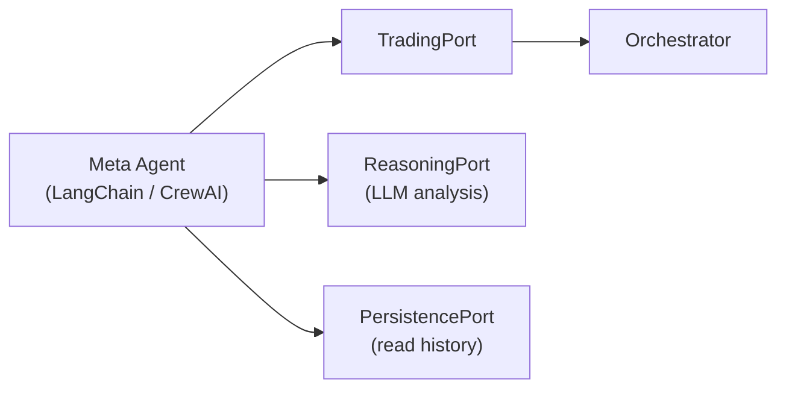

# Architecture Options: Q&A

## Q1: Are both Options A and B good for open-source standards?

**Short answer: Both are acceptable. Option A is "good enough." Option B is closer to what top-tier open-source trading frameworks look like.**

| Criterion | Option A (Medium) | Option B (Hexagonal) | What open-source projects typically do |
|-----------|-------------------|----------------------|----------------------------------------|
| **Separation of concerns** | ✅ Clear modules, but domain still imports infra (Redis, Binance SDK) transitively | ✅ Domain is pure Python — zero external imports | Top projects (Zipline, Lean, FreqTrade) have clean domain/infra separation |
| **Testability** | ⚠️ Testable with mocking, but you still need to mock infrastructure at module boundaries | ✅ Unit tests need zero mocks — domain is pure logic | Open-source contributors expect `pytest` to "just work" without running Redis/Binance |
| **Onboarding friction** | ✅ Simple structure, easy to navigate | ⚠️ More directories/files, steeper initial learning curve | Contributors prefer fewer concepts to learn, but will accept complexity if well-documented |
| **Plugin/adapter pattern** | ⚠️ Adapters exist but aren't behind strict ports | ✅ Formal ports make contribution boundaries crystal clear | Mature projects (FreqTrade, CCXT) use adapter patterns |
| **Backward compatibility** | ✅ Easier migration, fewer breaking changes | ⚠️ Requires re-export shims during migration | Open-source users hate breaking changes between versions |

**Bottom line**: If your goal is to open-source quickly and attract early contributors, **Option A is sufficient** — it removes the God object problem and gives you testable modules. If you're building for long-term community growth where people submit exchange adapters, strategy plugins, and storage backends, **Option B pays off** because the port/adapter boundary makes contribution rules self-documenting.

> [!TIP]
> Many successful open-source projects ship with Option A quality and evolve toward Option B as the community grows. The architecture doc already notes that A is a strict subset of B — no wasted work.

---

## Q2: Option B — Can you add LLM / Transformer / Agents to the flow?

**Yes, absolutely. Option B is actually the *best* architecture for this because the ports-and-adapters pattern was designed for exactly this kind of extensibility.**

Here's how each type of addition maps onto Option B's structure:

### Adding an LLM (e.g., GPT-4 / Gemini for trade reasoning)

The LLM is just another **output port adapter**. The domain doesn't care *how* a signal is generated:

```
domain/ports/reasoning_port.py        # New port ABC
adapters/reasoning/
    llm_adapter.py                     # Calls OpenAI / Gemini API
    rule_based_adapter.py              # Current strategy logic (backward compat)
    null_adapter.py                    # No reasoning, for tests
```

The `SignalProcessor` or `TradeOrchestrator` calls `self.reasoning.evaluate(market_context)` — it never knows if the answer came from an LLM, a rule, or a coin flip.

### Adding a Transformer model (e.g., replacing PPO with a time-series transformer)

The model is currently `AgentPPO`. In Option B, the agent/model becomes its own port:

```
domain/ports/prediction_port.py       # New port ABC: predict(state) → action
adapters/prediction/
    ppo_adapter.py                     # Wraps current AgentPPO
    transformer_adapter.py             # Wraps your new transformer model
    ensemble_adapter.py                # Calls both, blends predictions
```

The `TradeOrchestrator.execute_step()` already has step 3: `action = agent.predict(env)`. You'd change `agent` to a `PredictionPort` — same call, swappable implementation. **Zero changes to domain logic.**

### Adding AI Agents (e.g., an autonomous agent that manages portfolio strategy)

This maps to a **driving adapter** (input side). An AI agent that autonomously decides trades is just another way to *invoke* the `TradingPort`:

```
entrypoints/
    cli.py                             # Human triggers via CLI
    api_server.py                      # REST triggers
    agent_entrypoint.py                # AI agent triggers trades via TradingPort
```

The AI agent calls `orchestrator.execute_step()` the same way the CLI or scheduler does. You can also compose agents:



### Why Option B handles this well

The hexagonal boundary means:
1. **No changes to existing domain code** when adding LLM/transformer/agents
2. **Each new capability is a new adapter file** — isolated, testable, deployable independently
3. **DI container picks which adapter to use** — swap via config, not code changes
4. **You don't need a new architecture version** — this IS the extensible version

---

## Q3: Option A — Same question: Can you add LLM / Transformer / Agents?

**Yes, but with more friction and some coupling risks.**

### What works fine in Option A

Adding a **transformer model** to replace PPO is straightforward:
- `TradeOrchestrator` currently takes `agent` as a parameter
- You can pass any object with a compatible `.predict()` / `.act()` interface
- This is duck typing, not a formal port — it works but isn't enforced

```python
# Option A — works via duck typing
class TradeOrchestrator:
    def step(self, env, agent, user_input=False):
        action = agent.predict(env)  # PPO, Transformer, or anything with .predict()
```

### Where Option A gets awkward

| Addition | Option A Pain Point | Option B Equivalent |
|----------|---------------------|---------------------|
| **LLM for reasoning** | You'd add an `llm_client` parameter to `TradeOrchestrator.__init__()`. But there's no formal interface — every LLM integration has ad-hoc coupling to the orchestrator. | Clean `ReasoningPort` ABC; orchestrator only knows the interface. |
| **Swap notification from email to Slack+LLM summary** | `Notifier` ABC exists, but if the LLM summary needs trade context, you might start passing domain objects into the notifier, blurring boundaries. | `NotificationPort` is strict; context is passed as domain models, never raw infra objects. |
| **AI Agent as driver** | The orchestrator is still called from `RL_TradeBot.py` → not easy to have multiple entry points. You'd add another script that imports and calls the orchestrator directly. Works, but no formal entry point pattern. | `entrypoints/agent_entrypoint.py` — a first-class entry point alongside CLI and API. |
| **Multiple models (ensemble)** | You'd need to modify `step()` to accept a list of agents or add orchestration logic for ensembles. This touches core trade flow. | Create `EnsembleAdapter` implementing `PredictionPort` — zero changes to orchestrator. |
| **Model-as-a-service (remote inference)** | You'd need to handle HTTP calls, retries, timeouts inside the orchestrator or the agent wrapper. No boundary enforcing where network I/O lives. | `PredictionPort` adapter wraps the HTTP client. Domain stays pure. Network code stays in `adapters/`. |

### The real risk with Option A

Option A's modules use **ABC classes** for `Notifier`, `EventPublisher`, etc. — but they're not *architecturally enforced*. Nothing stops a future contributor from doing:

```python
# This would compile and work in Option A, but violates the boundary
class SignalProcessor:
    def process(self, env, user_input):
        import openai  # ← infra import in "domain-ish" code
        response = openai.chat(...)
        return Signal(action=response.action)
```

In Option B, this would go in `adapters/reasoning/llm_adapter.py` and the domain's `SignalProcessor` would only call `self.reasoning.evaluate()`.

### Bottom line for Option A

> [!IMPORTANT]
> Option A **can** accommodate LLM/transformer/agents, but each addition requires you to manually maintain discipline about where infrastructure code lives. With a solo developer or small team, this is fine. With open-source contributors, boundaries without enforcement tend to erode.

---

## Summary Decision Matrix

| Factor | Option A | Option B |
|--------|----------|----------|
| Open-source ready? | ✅ Yes, good enough | ✅ Yes, better |
| Add transformer model? | ✅ Easy (duck typing) | ✅ Easy (formal port) |
| Add LLM reasoning? | ⚠️ Possible, ad-hoc | ✅ Clean, via `ReasoningPort` |
| Add AI agent orchestration? | ⚠️ Possible, no formal entry point pattern | ✅ Clean, via `entrypoints/` |
| Ensemble / model composition? | ⚠️ Requires modifying orchestrator | ✅ Adapter pattern, zero orchestrator changes |
| Boundary enforcement for contributors? | ⚠️ Convention-based (docs + review) | ✅ Architecture-enforced (import rules) |
| Time to ship? | ✅ 1-2 weeks | ⚠️ 3-6 weeks |
| Needs new architecture later for AI features? | ⚠️ Likely some refactoring | ✅ No — this is the extensible version |

> [!TIP]
> **Practical recommendation**: If you know you'll be adding LLM/transformer/agent capabilities, start with Option A (ship quickly) but immediately adopt Option B's `domain/ports/` pattern for the **prediction** and **reasoning** boundaries. This gives you the critical extensibility where you need it without the full 6-week rewrite. You can migrate the rest (notification, persistence, metrics) to full hexagonal later.
