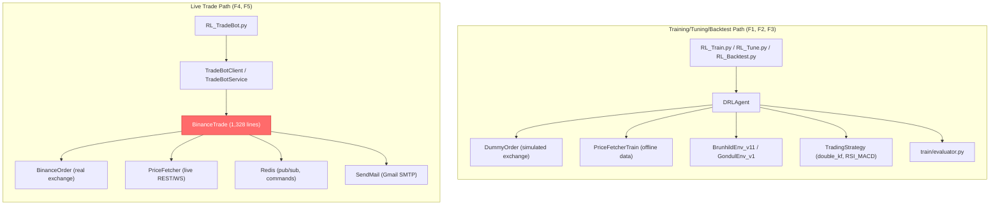
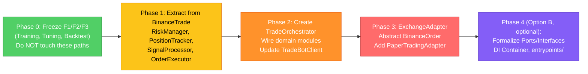

# Pre-Upgrade v2 Analysis: Functional Preservation Report

> **Purpose**: Evaluate whether all existing fundamental functionalities can be preserved during a progressive upgrade from Current → Option A → Option B. Correct the flawed assessment that "backtesting is hard in the current architecture" — the codebase already has working backtesting infrastructure independent of `BinanceTrade`.
> 
> **Related Analysis**: [Architecture Options (Refactoring Plan)](file:///Users/hamiltonwang/MyCode/AIHedge/diewalkure/Doc_v2/pre_upgrade_v2_analysis/architecture_options.md) | [Architecture QA](file:///Users/hamiltonwang/MyCode/AIHedge/diewalkure/Doc_v2/pre_upgrade_v2_analysis/architecture_qa.md)

---

## 1. Inventory of Fundamental Functionalities

The codebase has **six distinct operational modes**, each with its own entry point and dependency chain:

| # | Functionality | Entry Point | Shell Script | Key Class / Module |
|---|---------------|-------------|--------------|-------------------|
| F1 | **Training (RL)** | [RL_Train.py](file:///Users/hamiltonwang/MyCode/AIHedge/diewalkure/RL_Train.py) | `train.sh` | `DRLAgent` → `train_and_evaluate()` |
| F2 | **Hyperparameter Tuning** | [RL_Tune.py](file:///Users/hamiltonwang/MyCode/AIHedge/diewalkure/Tuner/RL_Tune.py) | `tune.sh` | `DRLAgent` + Optuna |
| F3 | **Backtesting** | [RL_Backtest.py](file:///Users/hamiltonwang/MyCode/AIHedge/diewalkure/RL_Backtest.py) | `backtest.sh` | `DRLAgent.DRL_prediction()` |
| F4 | **Live Trading (TradeBot)** | [RL_TradeBot.py](file:///Users/hamiltonwang/MyCode/AIHedge/diewalkure/RL_TradeBot.py) | `trade.sh` | `BinanceTrade` (via `TradeBotClient`) |
| F5 | **SaaS Trading (API Service)** | [RL_TradeBot.py](file:///Users/hamiltonwang/MyCode/AIHedge/diewalkure/RL_TradeBot.py) | Docker/K8s | `TradeBotService` (extends `TradeBotClient`) |
| F6 | **Kickstarter (Multi-bot Orchestrator)** | [RL_Kickstarter.py](file:///Users/hamiltonwang/MyCode/AIHedge/diewalkure/RL_Kickstarter.py) | Docker/PM2 | `Kickstarter` server |

### Supporting Functionalities

| # | Functionality | Entry Point | Description |
|---|---------------|-------------|-------------|
| S1 | **Indicator Generation** | [Gen_Indicator.py](file:///Users/hamiltonwang/MyCode/AIHedge/diewalkure/Gen_Indicator.py) | Pre-computes technical indicator data (Kalman filter, etc.) |
| S2 | **Trading Strategies** | [TradingStrategy/](file:///Users/hamiltonwang/MyCode/AIHedge/diewalkure/TradingStrategy) | Pluggable strategy modules (`double_kf`, `RSI_MACD`, etc.) |
| S3 | **Bot Environment Modes** | [app/enums.py](file:///Users/hamiltonwang/MyCode/AIHedge/diewalkure/app/enums.py) | `TRADE`, `MOCKING`, `SIMULATION`, `TRAIN`, `BACKTESTING` |

---

## 2. Corrected Architecture Assessment

### Previous (Flawed) Evaluation

> "Current: ❌ Hard — Redis, Gmail SMTP, and BinanceOrder SDK calls are hardcoded into step_trade()"

### Corrected Assessment

The statement above **only applies to `BinanceTrade.step_trade()`** — the live trading path. The backtesting functionality (`F3`) **does NOT use `BinanceTrade` at all**. It has its own independent path:



### Key Finding: Two Independent Architectures Already Exist

| Concern | Training / Tuning / Backtest (F1-F3) | Live Trade / SaaS (F4-F5) |
|---------|--------------------------------------|---------------------------|
| **Exchange API** | `DummyOrder` (simulated) | `BinanceOrder` (real) |
| **Price Source** | `PriceFetcherTrain` (offline parquet) | `PriceFetcher` (REST/WS) |
| **Redis** | ❌ Not used | ✅ Required (commands, status, pub/sub) |
| **Email** | ❌ Not used | ✅ Optional (`SEND_MAIL` env var) |
| **Scheduling** | ❌ Not used (loop-based) | ✅ `schedule` library |
| **Agent init** | `DRLAgent.get_model()` + `train_model()` | `BinanceTrade.__init__()` duplicates agent loading |
| **Env instantiation** | Via `DRLAgent` | Duplicated inside `BinanceTrade.__init__()` |
| **God Object?** | ❌ Clean separation | ✅ **`BinanceTrade` is the God Object** |

**Conclusion**: The "God Object" problem is **exclusively in the live trading path** (`BinanceTrade.py`). Training, tuning, and backtesting are already reasonably modular through `DRLAgent`.

---

## 3. Dependency Chain Analysis Per Functionality

### F1: Training (`RL_Train.py`)

```
RL_Train.py
├── args_loader() — loads cmd_args, hyper_args, env_args, trade_args, tech_args
├── BinanceOrder(SpotTest) → DummyOrder — just for exchange spec validation
├── DRLAgent
│   ├── load_env() → StockTradingEnvCls
│   ├── load_trading_strategy() → StrategyCls
│   ├── get_model("ppo") → Arguments (env + agent)
│   │   ├── PriceFetcherTrain (offline)
│   │   └── env_cls() — creates env instance
│   └── train_model() → train_and_evaluate() → Evaluator
└── No BinanceTrade involvement
```

**Refactoring Risk: NONE** — This path does not touch `BinanceTrade`.

---

### F2: Tuning (`RL_Tune.py`)

```
RL_Tune.py
├── args_loader()
├── BinanceOrder(SpotTest) → DummyOrder
├── DRLAgent (same as F1)
├── Optuna study
│   ├── sample_params_tech_args(trial)
│   ├── sample_params_hyper_args(trial)
│   └── objective() → DRLAgent.get_model() → DRLAgent.train_model()
└── No BinanceTrade involvement
```

**Refactoring Risk: NONE** — Same independent path as training.

---

### F3: Backtesting (`RL_Backtest.py`)

```
RL_Backtest.py
├── args_loader()
├── BinanceOrder(exch_mode) → DummyOrder (validates exchange specs only)
├── DRLAgent
│   ├── get_model("ppo") → loads env + agent
│   └── DRL_prediction(model, pod_cwd)
│       ├── init_agent() → loads trained weights from pod_dir
│       ├── env.reset()
│       ├── Loop: act(state) → env.step(action) → env.render()
│       └── Returns episode_returns, ds, strategy
├── Plotting: load_strategy_plotter() → plot_sim_func()
└── No BinanceTrade involvement
```

**Refactoring Risk: NONE** — Completely independent from `BinanceTrade`.

---

### F4: Live Trading (`RL_TradeBot.py` → `BinanceTrade`)

```
RL_TradeBot.py
├── trade_parse_arguments()
├── load_args() → exch_mode, hyper_args, env_args, trade_args, tech_args
├── init_bot(bot_env) → bot_env_args (TRADE / MOCKING / SIMULATION)
├── PriceFetcher (live REST or WS)
├── TradeBotClient
│   └── BinanceTrade.__init__() — ~300 lines of setup
│       ├── Redis setup (if SaaS mode)
│       ├── BinanceOrder / DummyOrder (based on app_env)
│       ├── load_trading_strategy()
│       ├── load_env() + env instantiation (DUPLICATED from DRLAgent)
│       ├── Agent loading (DUPLICATED from DRLAgent)
│       ├── Transaction history loading
│       ├── Schedule setup (step_trade, check_fee, check_xxx_now)
│       └── File-based signal files (ENTRY_NOW.txt, EXIT_NOW.txt)
│
│   └── BinanceTrade.step_trade() — ~230 lines
│       ├── Price fetch → strategy.step() → tech_ary
│       ├── User input override (entry_now / exit_now)
│       ├── check_trade_cash_change()
│       ├── check_cash_change()
│       ├── Model inference (act → action)
│       ├── env.step(action, prior_model)
│       ├── Txn order write
│       ├── _render() → logging
│       ├── _save_state() → CSV
│       ├── Risk checks (done_total_loss, done_drawdown, done_kelly)
│       ├── alert_mail()
│       └── Redis response publishing
│
└── TradeBotService (extends TradeBotClient)
    ├── Redis command listener (trade_commands, heartbeat)
    ├── Redis tradebot_status publishing
    ├── _handle_direct_command() (ExecuteBuy, ExecuteSell, CancelOrder, etc.)
    └── handle_market_update() (websocket price injection)
```

**Refactoring Risk: HIGH** — This is where all the coupling lives.

---

### F5: SaaS / API Service

Same as F4, with added `TradeBotService` layer. Adds:
- Redis command/response bus
- Tradebot args validation from database
- PM2 process status reporting
- Docker service name awareness

**Refactoring Risk: HIGH** — Inherits all F4 risks + Redis service layer.

---

### F6: Kickstarter (`kickstarter_server.py`)

```
RL_Kickstarter.py
├── Cassandra DB connection test
├── Kickstarter.__init__()
│   ├── Redis clients: kickstarter_commands, kickstarter_response, kickstarter_status
│   └── PM2 process manager
├── Listens for Redis commands → spawns/stops TradeBots via PM2
└── Manages tradebot lifecycle
```

**Refactoring Risk: LOW** — Kickstarter only spawns `RL_TradeBot.py` as subprocesses. Import path changes in `RL_TradeBot.py` are transparent to Kickstarter.

---

## 4. Functional Preservation Assessment

### 4.1 Progressive Upgrade: Current → Option A

Option A decomposes `BinanceTrade` into focused modules (`TradeOrchestrator`, `OrderExecutor`, `RiskManager`, `PositionTracker`, `SignalProcessor`) with an `ExchangeAdapter` abstraction.

| Functionality | Affected? | Preservation Strategy | Risk |
|:---|:---|:---|:---|
| **F1: Training** | ❌ No | Untouched. Uses `DRLAgent` path. | **None** |
| **F2: Tuning** | ❌ No | Untouched. Uses `DRLAgent` path. | **None** |
| **F3: Backtesting** | ❌ No | Untouched. Uses `DRLAgent.DRL_prediction()`. | **None** |
| **F4: Live Trading** | ✅ Yes | `BinanceTrade` → `TradeOrchestrator` + domain modules. `RL_TradeBot.py` imports `TradeOrchestrator` instead. `TradeBotClient` instantiates `TradeOrchestrator`. | **Moderate** |
| **F5: SaaS Trading** | ✅ Yes | `TradeBotService` extends `TradeBotClient` — the Redis command/response layer stays in `TradeBotService`, delegates trade execution to `TradeOrchestrator`. | **Moderate** |
| **F6: Kickstarter** | ⚠️ Minimal | Only if `RL_TradeBot.py` command-line interface changes. Keep CLI contract identical → zero risk. | **Low** |
| **S1: Gen_Indicator** | ❌ No | Independent pipeline. | **None** |
| **S2: Strategies** | ❌ No | Strategy classes are already pluggable. | **None** |
| **S3: Bot Env Modes** | ⚠️ Minimal | `BotEnv.TRADE/MOCKING/SIMULATION` routing stays in `RL_TradeBot.py`. | **Low** |

> [!IMPORTANT]
> **Option A does NOT touch F1, F2, F3 at all.** The training/tuning/backtesting pipeline is completely independent. The refactoring is **exclusively in the live trading path** (F4/F5).

### 4.2 Progressive Upgrade: Option A → Option B

Option B adds formal port/adapter interfaces, a `domain/` layer with zero external imports, and dependency injection via `entrypoints/container.py`.

| Functionality | Additional Impact Beyond Option A | Risk |
|:---|:---|:---|
| **F1: Training** | ❌ Still untouched. `DRLAgent` path remains separate. | **None** |
| **F2: Tuning** | ❌ Still untouched. | **None** |
| **F3: Backtesting** | ❌ Still untouched. | **None** |
| **F4: Live Trading** | `TradeOrchestrator` moves into `domain/services/`. Port interfaces formalized. `BinanceAdapter` implements `ExchangePort`. | **Low** (incremental from A) |
| **F5: SaaS Trading** | Redis command layer becomes a "Driving Adapter" in `entrypoints/`. `TradeBotService` logic → `RedisCommandListener` adapter. | **Moderate** |
| **F6: Kickstarter** | No change if CLI contract preserved. | **None** |

> [!TIP]
> **The biggest risk in Option B is not code breakage — it's the effort/time cost.** All fundamental functionality CAN be preserved because Option A → Option B is an additive transformation (wrap existing modules with interfaces, move them into `domain/` and `adapters/`).

---

## 5. What Could Actually Break (Risk Items)

### 5.1 Shared State in `env.exch_env.ds`

Both the training path and the live trading path use the same environment class (`BrunhildEnv_v11`) and its nested datastore (`env.exch_env.ds`). The `BinanceTrade` class accesses `env.exch_env.ds` directly for:

- Transaction history: `ds.load_txn_hist()`, `ds.read_write.write_txn_order()`
- Position tracking: `ds.get_position()`, `ds.get_last_cash()`, `ds.get_last_target_cash()`
- Index management: `ds.step_idx()`, `ds.get_idx()`
- Price injection: `ds.set_price()`
- Paper PnL: `ds.copy_last_paper_pnl()`

**Risk**: If Option A's `PositionTracker` or `OrderExecutor` wraps these `ds` calls, the env's internal state must remain consistent. Both the env's `step()` and the new domain modules must agree on the same datastore state.

**Mitigation**: Domain modules should delegate to `env.exch_env.ds` during migration (thin wrapper pattern). Don't duplicate state.

### 5.2 Duplicated Agent/Env Initialization

`BinanceTrade.__init__()` duplicates the env instantiation and agent loading that `DRLAgent.get_model()` already does. The Option A `TradeOrchestrator` should consolidate this, but must produce identical initialization results.

**Risk**: Subtle differences in how env is initialized (e.g., `form_end = None` set at line 82, or `step_idx()` call at line 306) could cause divergent behavior.

**Mitigation**: Extract `BinanceTrade.__init__()` lines 154–300 into a shared `create_live_env()` factory function, and verify the env state matches `DRLAgent.get_model()` output.

### 5.3 `TradeBotService` Redis Protocol

The Redis command/response protocol (`RedisCommandData`, `RedisJobType`, etc.) is tightly coupled to `TradeBotService` and `Kickstarter`. If `step_trade()` return format changes, the Redis response serialization breaks.

**Risk**: `step_trade()` currently returns `data_dict` and publishes `command_data_entity` to Redis. If `TradeOrchestrator.step()` returns a different structure, `TradeBotService._handle_direct_command()` breaks.

**Mitigation**: Keep the return contract of `step()` identical. Use an adapter to translate domain result → Redis response format.

### 5.4 File-Based Signal System

`ENTRY_NOW.txt`, `EXIT_NOW.txt`, `RESET_TRADE_CASH.txt` are polled by `check_xxx_now()` every 10 seconds. This is a simple but critical interface between the user and the bot.

**Risk**: Low. The signal file reading is isolated in `check_xxx_now()` and can be easily wrapped in a `SignalProcessor` module.

---

## 6. Recommended Migration Strategy



### Phase 0: Freeze F1/F2/F3 (Zero effort)

The training, tuning, and backtesting paths use `DRLAgent` and are completely independent from `BinanceTrade`. **Do not modify these entry points during the refactoring.** They are already clean enough.

### Phase 1: Extract domain modules from BinanceTrade (Option A core)

Extract these functions from `BinanceTrade.step_trade()` into separate modules:

| Module | Lines Extracted From | What It Wraps |
|--------|---------------------|---------------|
| `RiskManager` | L893-911 (done_total_loss, done_drawdown, done_kelly) | Risk threshold checks |
| `SignalProcessor` | L751-764 (strategy.step), L628-667 (check_xxx_now) | Strategy output + user input signals |
| `OrderExecutor` | L818-820 (env.step), L842-880 (txn order write) | env.step() + transaction recording |

### Phase 2: Create TradeOrchestrator

Replace the body of `step_trade()` with calls to extracted modules. Keep `BinanceTrade` as a thin shell during this phase for backward compat.

### Phase 3: ExchangeAdapter abstraction

Create `ExchangeAdapter` ABC, wrap `BinanceOrder` in `BinanceAdapter`. This enables the "simulated trading with live data" path (`BotEnv.SIMULATION`) to use a `PaperTradingAdapter` — which is the actual gap in the current architecture (not backtesting).

### Phase 4: Option B formalization (optional, future)

Move domain modules into `domain/services/`, create port interfaces, add dependency injection. This is additive and doesn't break anything from Phase 1-3.

---

## 7. Final Verdict

| Question | Answer |
|----------|--------|
| **Can all fundamental functions be kept during Current → Option A?** | ✅ **Yes.** F1/F2/F3 are completely untouched. F4/F5 are refactored but functionally equivalent. F6 is unaffected if CLI contract is preserved. |
| **Can all fundamental functions be kept during Option A → Option B?** | ✅ **Yes.** Option B is an additive transformation on top of Option A. No functionality is removed. |
| **What is actually broken in the current architecture?** | Not backtesting (already works independently). The real issues are: **(1)** `BinanceTrade` God Object makes the live trading path hard to test and maintain, **(2)** `BotEnv.SIMULATION` (paper trading with live data) lacks a proper paper exchange adapter, and **(3)** adding a new exchange requires duplicating 1,328 lines. |
| **What is the true risk?** | Not functional breakage, but **effort/time cost** and the risk of **subtle state inconsistencies** between `env.exch_env.ds` and new domain modules during migration. |

> [!CAUTION]
> The migration must be validated by running the existing `backtest.sh` and `trade.sh` scripts after each phase to confirm functional equivalence. Add integration tests for `step_trade()` output format before starting Phase 1.
