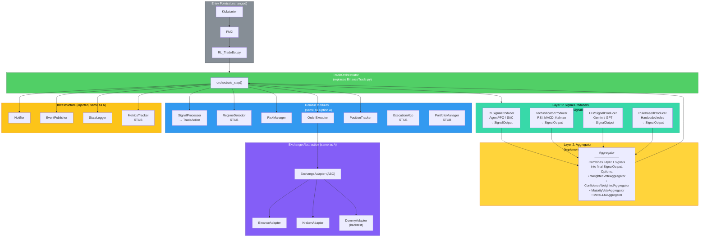
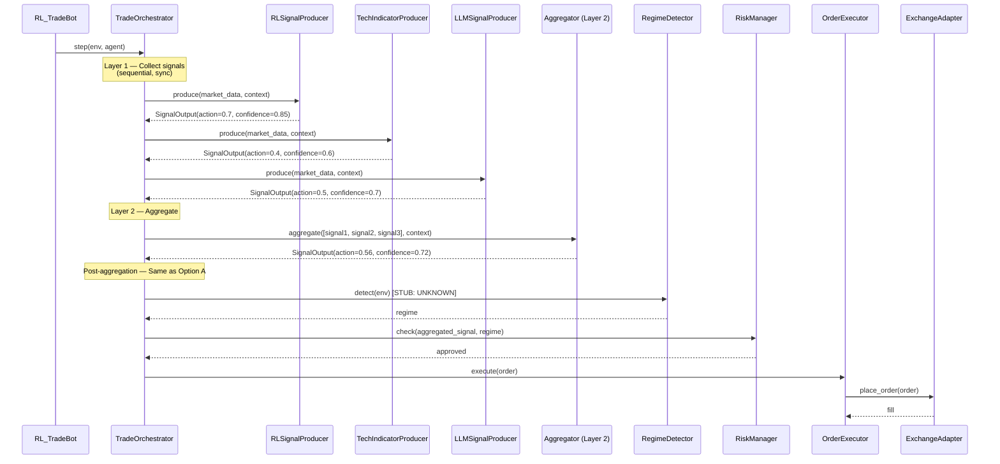
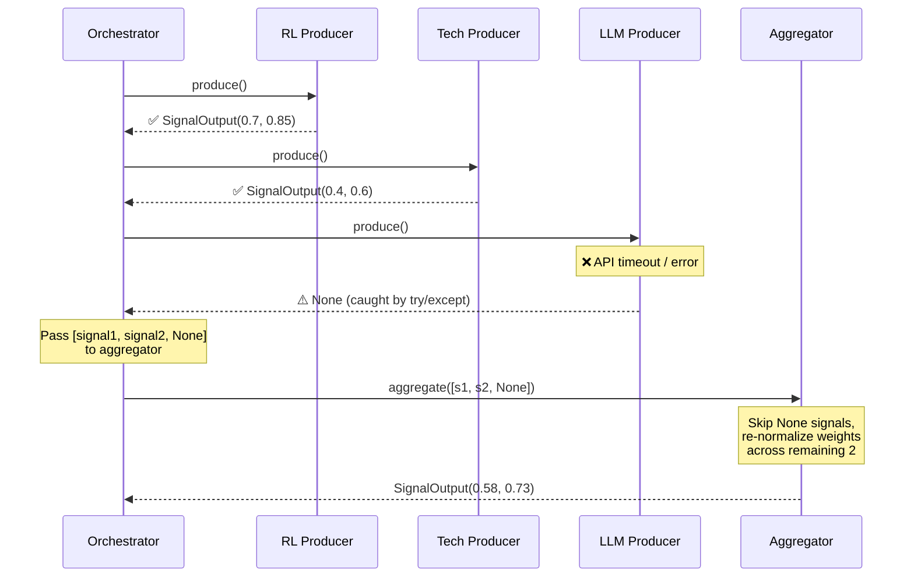

# Lightweight 2-Layer Hierarchical Signal Architecture

**Base**: Option A (Domain Module Extraction) + a minimal 2-layer signal hierarchy  
**Effort**: ~2-3 weeks (1 week beyond Option A)  
**Risk**: Low-Moderate  
**Concept**: Borrow Option B's hierarchical aggregation idea, but restrict to exactly **2 layers** and keep everything synchronous, in-process, and simple.

### Companion Documents

This architecture is documented across multiple files for manageability:

| Document | Content |
|----------|---------|
| **This file** | Core architecture, design philosophy, interfaces, implementations, JSON config, comparison tables |
| [Signal Contract](option_ab_signal_contract.md) | Contract enforcement philosophy, Pydantic validation, normalization guide |
| [Production Readiness](option_ab_production_readiness.md) | Phase 1/2/3 roadmap, all production implementations (timeout, health check, logging, audit, replay) |
| [Audience Analysis](option_ab_audience_analysis.md) | Power user vs retail developer gap matrix, verdict, effort estimates |
| [Documentation Plan](retail_developer_documentation_plan.md) | 9 retail developer docs to generate (QUICKSTART, CONFIG, CONTRIBUTING, etc.) |

---

## Design Philosophy

Option B introduces a powerful N-layer async DAG pipeline with JSON-configurable topology, but that power comes with significant complexity (DAG engine, async orchestration, per-node timeouts, graceful degradation, etc.). Many of those features are premature if you have 2-4 signal sources today.

**Option A(b)** asks: *What if we take Option A's clean module extraction and add just enough structure to support multiple heterogeneous signal sources with a simple 2-layer aggregation?*

The answer is a **fixed 2-layer architecture**:

| Layer | What it contains | Role |
|-------|-----------------|------|
| **Layer 1: Signal Producers** | Any mix of: LLM agent, technical indicator, trained RL model, hardcoded rules | Each produces a standardized `SignalOutput` independently |
| **Layer 2: Aggregator** | A single aggregator/ensemble OR a meta-LLM | Combines Layer 1 outputs into one final `SignalOutput` for the orchestrator |

This is **not** a general DAG. It's a **flat fan-in**: N producers → 1 aggregator. No intermediate super-signals, no recursive ensemble-of-ensembles, no async execution engine.

---

## How It Differs from A and B

| Aspect | Option A | **Option A(b)** | Option B |
|--------|----------|-----------------|----------|
| Signal sources | 1 (hardcoded) | **N (pluggable, typed list)** | N (pluggable via JSON DAG) |
| Aggregation | None | **1 fixed aggregator (Layer 2)** | Hierarchical (N layers, recursive) |
| Pipeline config | None | **JSON config (flat list)** | JSON/schema DAG |
| Execution model | Sequential | **Sequential (sync loop)** | Parallel async + per-node timeouts |
| DAG engine needed | No | **No** | Yes (~400+ lines) |
| Regime awareness | Stub | **Stub (same as A), can feed aggregator** | Dual (pipeline context + hard gate) |
| Graceful degradation | None | **Simple try/except per producer** | Timeout → exclude + re-weight |
| Adding a new signal | Add module, wire in orchestrator | **Implement `SignalProducer`, add to list** | Implement `SignalPort`, add JSON entry |
| Meta-LLM possible | No | **Yes (as aggregator)** | Yes (as meta-aggregator node) |
| Effort over Option A | — | **~1 week** | ~5-8 weeks |

---

## Architecture Diagram



---

## The Signal Contract (Minimal)

Two ABCs — one for producers, one for the aggregator. Both are simple, no async, no DAG awareness.

```python
# Trade/signals/signal_types.py
from dataclasses import dataclass
from typing import Optional

@dataclass(frozen=True)
class SignalOutput:
    """Standardized output from any signal source."""
    signal_name: str
    action: float        # -1.0 (strong sell) to +1.0 (strong buy)
    confidence: float    # 0.0 (no confidence) to 1.0 (full confidence)
    metadata: dict = None  # Optional: model_version, reasoning, raw_scores, etc.
```

> [!NOTE]
> This minimal `dataclass` version shows the shape of the contract. For production, this is replaced with a **Pydantic model** that validates `action ∈ [-1, 1]` and `confidence ∈ [0, 1]` on construction — see [Signal Contract Enforcement Philosophy](#signal-contract-enforcement-philosophy) below.

```python
# Trade/signals/signal_producer.py
from abc import ABC, abstractmethod
from Trade.signals.signal_types import SignalOutput

class SignalProducer(ABC):
    """Layer 1: Any source that produces a trading signal."""

    @property
    @abstractmethod
    def name(self) -> str:
        """Unique identifier for this producer."""
        ...

    @abstractmethod
    def produce(self, market_data: dict, context: dict) -> SignalOutput:
        """
        Generate a signal from market data.
        
        Args:
            market_data: OHLCV + any enriched data
            context: regime, upstream info, config
        
        Returns:
            SignalOutput with action in [-1, 1] and confidence in [0, 1]
        """
        ...
```

```python
# Trade/signals/signal_aggregator.py
from abc import ABC, abstractmethod
from typing import List
from Trade.signals.signal_types import SignalOutput

class SignalAggregator(ABC):
    """Layer 2: Combines multiple SignalOutputs into one final signal."""

    @abstractmethod
    def aggregate(self, signals: List[SignalOutput], context: dict) -> SignalOutput:
        """
        Combine producer signals into a single trading decision.
        
        Args:
            signals: All Layer 1 outputs (may include None for failed producers)
            context: regime, weights config, etc.
        
        Returns:
            Final aggregated SignalOutput
        """
        ...
```

> [!NOTE]
> Notice that `SignalAggregator` does **not** implement `SignalProducer`. This is intentional — no recursive composition, no ensemble-of-ensembles. The 2-layer constraint is enforced by the type system.

---

## Concrete Producer Implementations

### RLSignalProducer (wraps existing AgentPPO)

```python
# Trade/signals/producers/rl_producer.py
class RLSignalProducer(SignalProducer):
    """Wraps the existing RL agent (PPO, SAC, etc.) as a signal producer."""

    def __init__(self, agent, env, name: str = "rl_ppo"):
        self._agent = agent
        self._env = env
        self._name = name

    @property
    def name(self) -> str:
        return self._name

    def produce(self, market_data: dict, context: dict) -> SignalOutput:
        action = self._agent.predict(self._env)
        # Map RL action space to [-1, 1]
        normalized = float(action[0]) if hasattr(action, '__len__') else float(action)
        return SignalOutput(
            signal_name=self._name,
            action=max(-1.0, min(1.0, normalized)),
            confidence=0.8,  # RL doesn't natively emit confidence; use fixed or derive from value head
            metadata={"raw_action": action.tolist() if hasattr(action, 'tolist') else action}
        )
```

### TechIndicatorProducer (wraps existing TradingStrategy)

```python
# Trade/signals/producers/tech_indicator_producer.py
class TechIndicatorProducer(SignalProducer):
    """Wraps existing TradingStrategy (double_kf, rsi_macd, etc.) as a signal producer."""

    def __init__(self, strategy, name: str = "tech_indicator"):
        self._strategy = strategy
        self._name = name

    @property
    def name(self) -> str:
        return self._name

    def produce(self, market_data: dict, context: dict) -> SignalOutput:
        # strategy.get_signal() returns the existing strategy output
        raw_signal = self._strategy.get_signal(market_data)
        return SignalOutput(
            signal_name=self._name,
            action=float(raw_signal.get("action", 0.0)),
            confidence=float(raw_signal.get("confidence", 0.5)),
            metadata={"strategy": self._strategy.name, "raw": raw_signal}
        )
```

### LLMSignalProducer (new)

```python
# Trade/signals/producers/llm_producer.py
class LLMSignalProducer(SignalProducer):
    """Calls an LLM (Gemini, GPT, etc.) for market reasoning."""

    def __init__(self, api_client, prompt_template: str, name: str = "llm_reasoning"):
        self._client = api_client
        self._prompt_template = prompt_template
        self._name = name

    @property
    def name(self) -> str:
        return self._name

    def produce(self, market_data: dict, context: dict) -> SignalOutput:
        prompt = self._prompt_template.format(
            price=market_data.get("close"),
            volume=market_data.get("volume"),
            regime=context.get("regime", "UNKNOWN"),
        )
        try:
            response = self._client.generate(prompt)
            parsed = self._parse_llm_response(response)
            return SignalOutput(
                signal_name=self._name,
                action=parsed["action"],
                confidence=parsed["confidence"],
                metadata={"raw_response": response, "model": self._client.model_name}
            )
        except Exception as e:
            # Graceful degradation: return neutral signal on failure
            return SignalOutput(
                signal_name=self._name,
                action=0.0,
                confidence=0.0,
                metadata={"error": str(e)}
            )

    def _parse_llm_response(self, response: str) -> dict:
        """Parse structured LLM output into action/confidence."""
        # Implementation depends on prompt design (JSON output, etc.)
        ...
```

### RuleBasedProducer (hardcoded rules)

```python
# Trade/signals/producers/rule_producer.py
class RuleBasedProducer(SignalProducer):
    """Simple hardcoded rules — e.g., 'if RSI < 30 and volume spike, buy'."""

    def __init__(self, rules: list, name: str = "rules"):
        self._rules = rules
        self._name = name

    @property
    def name(self) -> str:
        return self._name

    def produce(self, market_data: dict, context: dict) -> SignalOutput:
        votes = []
        for rule in self._rules:
            result = rule.evaluate(market_data, context)
            if result is not None:
                votes.append(result)

        if not votes:
            return SignalOutput(self._name, action=0.0, confidence=0.0)

        avg_action = sum(v.action for v in votes) / len(votes)
        avg_conf = sum(v.confidence for v in votes) / len(votes)
        return SignalOutput(self._name, action=avg_action, confidence=avg_conf)
```

---

## Concrete Aggregator Implementations

### WeightedVoteAggregator (simplest)

```python
# Trade/signals/aggregators/weighted_vote.py
class WeightedVoteAggregator(SignalAggregator):
    """Confidence-weighted average of all producer signals."""

    def aggregate(self, signals: List[SignalOutput], context: dict) -> SignalOutput:
        # Filter out failed/zero-confidence signals
        valid = [s for s in signals if s is not None and s.confidence > 0]

        if not valid:
            return SignalOutput("aggregated", action=0.0, confidence=0.0)

        total_weight = sum(s.confidence for s in valid)
        weighted_action = sum(s.action * s.confidence for s in valid) / total_weight
        avg_confidence = total_weight / len(valid)

        return SignalOutput(
            signal_name="aggregated",
            action=max(-1.0, min(1.0, weighted_action)),
            confidence=avg_confidence,
            metadata={"sources": {s.signal_name: s.action for s in valid}}
        )
```

### FixedWeightAggregator (explicit control)

```python
# Trade/signals/aggregators/fixed_weight.py
class FixedWeightAggregator(SignalAggregator):
    """User-specified fixed weights per signal source."""

    def __init__(self, weights: dict):
        """
        Args:
            weights: {"rl_ppo": 0.4, "tech_indicator": 0.3, "llm_reasoning": 0.2, "rules": 0.1}
        """
        self._weights = weights

    def aggregate(self, signals: List[SignalOutput], context: dict) -> SignalOutput:
        weighted_action = 0.0
        total_weight = 0.0

        for s in signals:
            if s is None or s.signal_name not in self._weights:
                continue
            w = self._weights[s.signal_name]
            weighted_action += s.action * w
            total_weight += w

        if total_weight == 0:
            return SignalOutput("aggregated", action=0.0, confidence=0.0)

        # Re-normalize if some producers failed
        weighted_action /= total_weight
        avg_confidence = sum(
            s.confidence for s in signals
            if s and s.signal_name in self._weights
        ) / len([s for s in signals if s and s.signal_name in self._weights])

        return SignalOutput(
            signal_name="aggregated",
            action=max(-1.0, min(1.0, weighted_action)),
            confidence=avg_confidence,
            metadata={
                "weights_used": {s.signal_name: self._weights[s.signal_name]
                                 for s in signals if s and s.signal_name in self._weights}
            }
        )
```

### MetaLLMAggregator (LLM as the decision maker)

```python
# Trade/signals/aggregators/meta_llm.py
class MetaLLMAggregator(SignalAggregator):
    """Uses an LLM to reason over all producer signals and make the final call."""

    def __init__(self, api_client, prompt_template: str):
        self._client = api_client
        self._prompt_template = prompt_template

    def aggregate(self, signals: List[SignalOutput], context: dict) -> SignalOutput:
        # Build a structured summary of all signals for the LLM
        signal_summary = "\n".join(
            f"- {s.signal_name}: action={s.action:.3f}, confidence={s.confidence:.3f}"
            for s in signals if s is not None
        )

        prompt = self._prompt_template.format(
            signals=signal_summary,
            regime=context.get("regime", "UNKNOWN"),
            position=context.get("position", "none"),
        )

        try:
            response = self._client.generate(prompt)
            parsed = self._parse_response(response)
            return SignalOutput(
                signal_name="meta_llm",
                action=parsed["action"],
                confidence=parsed["confidence"],
                metadata={
                    "reasoning": parsed.get("reasoning", ""),
                    "input_signals": signal_summary,
                }
            )
        except Exception:
            # Fallback: use confidence-weighted average
            fallback = WeightedVoteAggregator()
            return fallback.aggregate(signals, context)

    def _parse_response(self, response: str) -> dict:
        """Parse structured LLM output."""
        ...
```

---

## Data Flow (Step-by-Step)



---

## How the Orchestrator Changes (vs Option A)

In Option A, the orchestrator calls a single `SignalProcessor`. In A(b), it runs a signal loop + aggregation:

```python
# Trade/trade_orchestrator.py — Option A(b) version
from typing import List
from Trade.signals.signal_producer import SignalProducer
from Trade.signals.signal_aggregator import SignalAggregator
from Trade.signals.signal_types import SignalOutput
import logging

logger = logging.getLogger(__name__)


class TradeOrchestrator:
    def __init__(
        self,
        producers: List[SignalProducer],       # NEW: Layer 1
        aggregator: SignalAggregator,           # NEW: Layer 2
        exchange,
        risk,
        signal_processor,
        notifier,
        publisher,
        state_logger,
        regime_detector=None,
    ):
        self.producers = producers
        self.aggregator = aggregator
        self.exchange = exchange
        self.risk = risk
        self.signal_processor = signal_processor
        self.notifier = notifier
        self.publisher = publisher
        self.state_logger = state_logger
        self.regime_detector = regime_detector

    def step(self, env, agent, user_input=False) -> dict:
        market_data = self._get_market_data(env)
        context = {"regime": "UNKNOWN"}

        if self.regime_detector:
            context["regime"] = self.regime_detector.detect(env)

        # ── Layer 1: Collect signals ──────────────────────
        signals: List[SignalOutput] = []
        for producer in self.producers:
            try:
                sig = producer.produce(market_data, context)
                signals.append(sig)
                logger.info(f"[{producer.name}] action={sig.action:.3f} conf={sig.confidence:.3f}")
            except Exception as e:
                logger.warning(f"[{producer.name}] failed: {e}")
                signals.append(None)  # Aggregator handles None

        # ── Layer 2: Aggregate ────────────────────────────
        aggregated = self.aggregator.aggregate(signals, context)
        logger.info(f"[aggregated] action={aggregated.action:.3f} conf={aggregated.confidence:.3f}")

        # ── Post-aggregation: same as Option A ────────────
        action_signal = self.signal_processor.to_trade_action(aggregated)
        action_signal = self.risk.check(action_signal, env)

        if not user_input:
            action = agent.predict(env)
        else:
            action = None

        state, reward, done, result = env.step(action, action_signal)

        self.state_logger.log(state, result)
        self.publisher.publish(result)
        if self.risk.should_alert(env):
            self.notifier.alert(self.risk.alert_message)

        return result

    def _get_market_data(self, env) -> dict:
        """Extract current market snapshot from the environment."""
        # Adapt to your env's API
        return {"close": env.current_price, "volume": env.current_volume}
```

---

## Pipeline Configuration (JSON)

Instead of hardcoding producers in Python, the pipeline is defined in a **JSON config file**. The user chooses which producers and which aggregator to use — any combination is valid (3 LLMs, 2 RL models, 1 of each, etc.). No Python code changes needed.

### Config Schema

```json
{
  "pipeline": {
    "producers": [
      {
        "id": "unique_name",
        "type": "rl | tech_indicator | llm | rule_based",
        "config": { "...type-specific config..." }
      }
    ],
    "aggregator": {
      "type": "weighted_vote | fixed_weight | majority_vote | meta_llm",
      "config": { "...aggregator-specific config..." }
    }
  }
}
```

### Example 1: Mixed (RL + Tech + LLM)

```json
{
  "pipeline": {
    "producers": [
      {
        "id": "rl_ppo",
        "type": "rl",
        "config": { "model_path": "pod_000042/", "agent": "ppo" }
      },
      {
        "id": "tech_kalman",
        "type": "tech_indicator",
        "config": { "strategy": "double_kf", "params_file": "tech_args/double_kf.json" }
      },
      {
        "id": "llm_gemini",
        "type": "llm",
        "config": { "model": "gemini-2.0-flash", "prompt_template": "market_analysis_v2" }
      }
    ],
    "aggregator": {
      "type": "fixed_weight",
      "config": {
        "weights": { "rl_ppo": 0.5, "tech_kalman": 0.3, "llm_gemini": 0.2 }
      }
    }
  }
}
```

### Example 2: Three LLMs Only (No RL, No Tech)

```json
{
  "pipeline": {
    "producers": [
      {
        "id": "llm_gemini",
        "type": "llm",
        "config": { "model": "gemini-2.0-flash", "prompt_template": "market_analysis_v2" }
      },
      {
        "id": "llm_gpt4",
        "type": "llm",
        "config": { "model": "gpt-4o", "prompt_template": "contrarian_analysis" }
      },
      {
        "id": "llm_claude",
        "type": "llm",
        "config": { "model": "claude-sonnet-4", "prompt_template": "risk_assessment" }
      }
    ],
    "aggregator": {
      "type": "weighted_vote",
      "config": {}
    }
  }
}
```

### Example 3: Two RL Models with Meta-LLM Aggregator

```json
{
  "pipeline": {
    "producers": [
      {
        "id": "rl_ppo",
        "type": "rl",
        "config": { "model_path": "pod_000042/", "agent": "ppo" }
      },
      {
        "id": "rl_sac",
        "type": "rl",
        "config": { "model_path": "pod_000099/", "agent": "sac" }
      }
    ],
    "aggregator": {
      "type": "meta_llm",
      "config": {
        "model": "gemini-2.0-flash",
        "prompt_template": "meta_decision"
      }
    }
  }
}
```

### Example 4: Single RL Only (Backward Compatible with Current)

```json
{
  "pipeline": {
    "producers": [
      {
        "id": "rl_ppo",
        "type": "rl",
        "config": { "model_path": "pod_000042/", "agent": "ppo" }
      }
    ],
    "aggregator": {
      "type": "weighted_vote",
      "config": {}
    }
  }
}
```

> [!NOTE]
> With a single producer and `weighted_vote`, the aggregator is effectively a passthrough — the system behaves identically to today's single-RL flow. This is your backward-compatible default.

---

## Pipeline Config Loader

A simple factory that reads the JSON and builds the producer list + aggregator. This is the **only place** that maps `type` strings to Python classes:

```python
# Trade/signals/pipeline_loader.py
import json
from typing import List, Tuple
from Trade.signals.signal_producer import SignalProducer
from Trade.signals.signal_aggregator import SignalAggregator

# Registry of known producer types
PRODUCER_REGISTRY = {
    "rl": "Trade.signals.producers.rl_producer.RLSignalProducer",
    "tech_indicator": "Trade.signals.producers.tech_indicator_producer.TechIndicatorProducer",
    "llm": "Trade.signals.producers.llm_producer.LLMSignalProducer",
    "rule_based": "Trade.signals.producers.rule_producer.RuleBasedProducer",
}

# Registry of known aggregator types
AGGREGATOR_REGISTRY = {
    "weighted_vote": "Trade.signals.aggregators.weighted_vote.WeightedVoteAggregator",
    "fixed_weight": "Trade.signals.aggregators.fixed_weight.FixedWeightAggregator",
    "majority_vote": "Trade.signals.aggregators.majority_vote.MajorityVoteAggregator",
    "meta_llm": "Trade.signals.aggregators.meta_llm.MetaLLMAggregator",
}


def load_pipeline(config_path: str, runtime_deps: dict = None
) -> Tuple[List[SignalProducer], SignalAggregator]:
    """
    Load pipeline config from JSON, instantiate producers and aggregator.
    
    Args:
        config_path: Path to pipeline.json
        runtime_deps: Runtime objects that can't live in JSON
                      (e.g., {"env": env, "agent_ppo": agent, "gemini_client": client})
    
    Returns:
        (list of SignalProducers, SignalAggregator)
    """
    runtime_deps = runtime_deps or {}

    with open(config_path) as f:
        config = json.load(f)["pipeline"]

    # Build producers
    producers = []
    for node in config["producers"]:
        cls = _import_class(PRODUCER_REGISTRY[node["type"]])
        producer = cls.from_config(node["id"], node["config"], runtime_deps)
        producers.append(producer)

    # Build aggregator
    agg_spec = config["aggregator"]
    agg_cls = _import_class(AGGREGATOR_REGISTRY[agg_spec["type"]])
    aggregator = agg_cls.from_config(agg_spec["config"], runtime_deps)

    return producers, aggregator


def _import_class(dotted_path: str):
    """Import a class from a dotted path string."""
    module_path, class_name = dotted_path.rsplit(".", 1)
    import importlib
    module = importlib.import_module(module_path)
    return getattr(module, class_name)
```

Each producer/aggregator class adds a `from_config` classmethod:

```python
# Example: Trade/signals/producers/llm_producer.py
class LLMSignalProducer(SignalProducer):
    # ... existing __init__ and produce() ...

    @classmethod
    def from_config(cls, name: str, config: dict, runtime_deps: dict) -> "LLMSignalProducer":
        """Build from JSON config + runtime dependencies."""
        # The LLM client can't be serialized in JSON — it comes from runtime_deps
        client_key = config.get("client_key", config["model"])  # e.g., "gemini-2.0-flash"
        api_client = runtime_deps.get(client_key) or runtime_deps.get("default_llm_client")
        return cls(
            api_client=api_client,
            prompt_template=config["prompt_template"],
            name=name,
        )
```

---

## Wiring in RL_TradeBot.py (After Config Loader)

With the JSON config, the Python wiring becomes trivial:

```python
# In RL_TradeBot.py
from Trade.signals.pipeline_loader import load_pipeline

# Runtime dependencies that can't be in JSON
runtime_deps = {
    "env": env,
    "agent_ppo": agent,
    "agent_sac": agent_sac,        # if using multiple RL agents
    "gemini-2.0-flash": gemini_client,
    "gpt-4o": openai_client,
    "claude-sonnet-4": claude_client,
    "strategy": strategy,
    "default_llm_client": gemini_client,
}

# One line to build the entire signal pipeline from config
producers, aggregator = load_pipeline("pipeline.json", runtime_deps)

# Build orchestrator (everything else identical to Option A)
orchestrator = TradeOrchestrator(
    producers=producers,
    aggregator=aggregator,
    exchange=binance_adapter,
    risk=risk_manager,
    signal_processor=signal_processor,
    notifier=email_notifier,
    publisher=redis_publisher,
    state_logger=csv_logger,
)
```

> [!TIP]
> **To switch from "RL + Tech + LLM" to "3 LLMs only"**, you just edit `pipeline.json` — no Python code changes. This is the same user experience as Option B's JSON config, but without the DAG engine complexity.

---

## New Files (Beyond Option A)

| New File | Lines (est.) | Purpose |
|----------|-------------|---------|
| `Trade/signals/__init__.py` | ~5 | Package init |
| `Trade/signals/signal_types.py` | ~20 | `SignalOutput` dataclass |
| `Trade/signals/signal_producer.py` | ~25 | `SignalProducer` ABC |
| `Trade/signals/signal_aggregator.py` | ~20 | `SignalAggregator` ABC |
| `Trade/signals/pipeline_loader.py` | ~70 | JSON config → Python objects factory |
| `Trade/signals/producers/rl_producer.py` | ~50 | Wraps AgentPPO (+ `from_config`) |
| `Trade/signals/producers/tech_indicator_producer.py` | ~45 | Wraps TradingStrategy (+ `from_config`) |
| `Trade/signals/producers/llm_producer.py` | ~70 | LLM signal source (+ `from_config`) |
| `Trade/signals/producers/rule_producer.py` | ~50 | Hardcoded rules (+ `from_config`) |
| `Trade/signals/aggregators/weighted_vote.py` | ~40 | Confidence-weighted average (+ `from_config`) |
| `Trade/signals/aggregators/fixed_weight.py` | ~55 | Explicit weight map (+ `from_config`) |
| `Trade/signals/aggregators/meta_llm.py` | ~70 | LLM as meta-reasoner (+ `from_config`) |
| `pipeline.json` | ~30 | Default pipeline config |
| **Total new code** | **~550** | — |

> [!TIP]
> This is ~550 lines of new code on top of Option A. Compare to Option B's DAG engine alone which is ~400+ lines, plus the JSON config schema, async execution, timeout handling, etc. The config loader adds ~170 lines but gives you the same "edit JSON, not Python" experience as Option B.

---

## Modified Files (vs Option A)

| File | Change |
|------|--------|
| `Trade/trade_orchestrator.py` | Accept `producers: List[SignalProducer]` + `aggregator: SignalAggregator` instead of a single signal processor. Add the Layer 1/2 loop. |
| `RL_TradeBot.py` | Wire producers and aggregator into the orchestrator constructor. |

Everything else from Option A (exchange adapters, notifier, event publisher, risk manager, etc.) is **unchanged**.

---

## Graceful Degradation (Simple Version)

No timeout engine. No async. Just try/except per producer:



---

## Multi-Timeframe Signal Composition (1D / 1H / 5M)

The `produce(self, market_data: dict, context: dict)` signature is intentionally generic. This section specifies how `market_data` carries multiple timeframe DataFrames and how producers handle different update frequencies.

### The Problem

A 5-minute execution loop runs `produce()` every 5 minutes, but:
- A **1D Kalman trend filter** only changes once per day — recomputing it 288 times/day wastes CPU and adds latency.
- A **1H RSI** changes every hour — recomputing it 12 times between updates produces the same value.
- An **LLM macro analysis** based on 1D data is expensive and shouldn't run every 5 minutes.

Without an explicit convention, each producer must independently solve caching, staleness detection, and timeframe alignment. This section standardizes that.

### Multi-Timeframe `market_data` Schema

The orchestrator is responsible for populating `market_data` with all available timeframes. Producers pick the timeframes they need.

```python
# What the orchestrator passes to every producer:
market_data = {
    # Primary execution timeframe — always present
    "5m": {
        "df": pd.DataFrame(...),      # OHLCV DataFrame, latest N bars
        "last_close": 67432.50,
        "last_volume": 1234.5,
        "updated_at": datetime(2026, 7, 28, 10, 35),  # UTC
    },
    
    # Higher timeframes — present if configured
    "1h": {
        "df": pd.DataFrame(...),      # OHLCV DataFrame, latest N bars
        "last_close": 67400.00,
        "last_volume": 45678.9,
        "updated_at": datetime(2026, 7, 28, 10, 0),
    },
    
    "1d": {
        "df": pd.DataFrame(...),      # OHLCV DataFrame, latest N bars
        "last_close": 67100.00,
        "last_volume": 890123.4,
        "updated_at": datetime(2026, 7, 28, 0, 0),
    },
}
```

**Convention**:
- Keys are standard interval strings: `"1m"`, `"5m"`, `"15m"`, `"1h"`, `"4h"`, `"1d"`.
- Each value is a dict with `df` (DataFrame), `last_close`, `last_volume`, and `updated_at`.
- The orchestrator updates each timeframe at its natural cadence (see below).
- Producers that only need the execution timeframe access `market_data["5m"]` and ignore the rest.

### Orchestrator: Timeframe Update Logic

The orchestrator updates higher timeframes on their natural boundaries. Between updates, the cached data is re-passed to producers unchanged.

```python
# In TradeOrchestrator.__init__()
self._timeframe_cache: Dict[str, dict] = {}
self._timeframe_intervals = {
    "5m":  timedelta(minutes=5),
    "1h":  timedelta(hours=1),
    "4h":  timedelta(hours=4),
    "1d":  timedelta(days=1),
}

def _get_market_data(self, env) -> dict:
    """Build multi-timeframe market_data dict.
    
    The execution timeframe (e.g., 5m) is always fresh.
    Higher timeframes are updated only when their interval elapses.
    """
    now = datetime.now(timezone.utc)
    
    # Always update the execution timeframe
    self._timeframe_cache["5m"] = {
        "df": env.get_ohlcv("5m"),
        "last_close": env.current_price,
        "last_volume": env.current_volume,
        "updated_at": now,
    }
    
    # Update higher timeframes only at their natural cadence
    for tf, interval in self._timeframe_intervals.items():
        if tf == "5m":
            continue
        cached = self._timeframe_cache.get(tf)
        if cached is None or (now - cached["updated_at"]) >= interval:
            df = env.get_ohlcv(tf)
            self._timeframe_cache[tf] = {
                "df": df,
                "last_close": float(df["close"].iloc[-1]),
                "last_volume": float(df["volume"].iloc[-1]),
                "updated_at": now,
            }
    
    return self._timeframe_cache
```

### Producer Caching Pattern

Producers that use higher timeframes should cache their derived signals and only recompute when the underlying data updates. This keeps the 5-minute loop fast.

```python
class MultiTimeframeTechProducer(SignalProducer):
    """Example: Only allow BUY if the 1D Kalman trend is positive."""

    def __init__(self, name: str, strategy_5m, kalman_1d):
        self._name = name
        self._strategy_5m = strategy_5m  # Fast: runs on 5m data
        self._kalman_1d = kalman_1d      # Slow: runs on 1d data
        
        # Cache for slow computation
        self._cached_1d_trend: Optional[float] = None
        self._cached_1d_updated_at: Optional[datetime] = None

    @property
    def name(self) -> str:
        return self._name

    def produce(self, market_data: dict, context: dict) -> SignalOutput:
        # ── Fast path: 5m signal (runs every step) ────
        data_5m = market_data["5m"]
        raw_signal = self._strategy_5m.compute(data_5m["df"])
        
        # ── Slow path: 1d trend (cached, recomputes ~1x/day) ──
        data_1d = market_data.get("1d")
        if data_1d is not None:
            if (self._cached_1d_updated_at is None or 
                data_1d["updated_at"] > self._cached_1d_updated_at):
                # 1D data has been refreshed — recompute
                self._cached_1d_trend = self._kalman_1d.trend(data_1d["df"])
                self._cached_1d_updated_at = data_1d["updated_at"]
        
        # ── Gate: only BUY if macro trend is positive ──────
        action = raw_signal
        if action > 0 and self._cached_1d_trend is not None:
            if self._cached_1d_trend < 0:
                # Macro downtrend — suppress buy signal
                action = 0.0
        
        confidence = abs(action) * 0.8
        return SignalOutput(
            signal_name=self._name,
            action=max(-1.0, min(1.0, action)),
            confidence=min(1.0, confidence),
            metadata={
                "raw_5m_signal": raw_signal,
                "trend_1d": self._cached_1d_trend,
                "trend_1d_stale_minutes": (
                    (datetime.now(timezone.utc) - self._cached_1d_updated_at).total_seconds() / 60
                    if self._cached_1d_updated_at else None
                ),
            },
        )
    
    def health_check(self) -> None:
        if self._strategy_5m is None:
            raise RuntimeError(f"[{self.name}] 5m strategy not loaded")
        if self._kalman_1d is None:
            raise RuntimeError(f"[{self.name}] 1D Kalman filter not loaded")

    @classmethod
    def from_config(cls, name: str, config: dict, runtime_deps: dict):
        return cls(
            name=name,
            strategy_5m=runtime_deps[config["strategy_5m_key"]],
            kalman_1d=runtime_deps[config["kalman_1d_key"]],
        )
```

### JSON Config for Multi-Timeframe

No new JSON fields are needed — the multi-timeframe behavior is configured through producer-specific `config` and the orchestrator's timeframe list.

```json
{
  "pipeline": {
    "producers": [
      {
        "id": "rl_ppo",
        "type": "rl",
        "timeout_seconds": 1.0,
        "config": { "model_path": "pod_000042/", "agent": "ppo" }
      },
      {
        "id": "tech_mtf",
        "type": "tech_indicator",
        "timeout_seconds": 2.0,
        "config": {
          "strategy": "multi_timeframe_kf",
          "strategy_5m_key": "strategy_double_kf",
          "kalman_1d_key": "kalman_1d_trend",
          "timeframes_required": ["5m", "1d"]
        }
      },
      {
        "id": "llm_macro",
        "type": "llm",
        "timeout_seconds": 15.0,
        "config": {
          "model": "gemini-2.0-flash",
          "prompt_template": "macro_trend_analysis",
          "preferred_timeframe": "1d"
        }
      }
    ],
    "aggregator": { "type": "weighted_vote", "config": {} },
    "settings": { "min_valid_signals": 2 }
  }
}
```

### Design Decisions

| Decision | Choice | Rationale |
|----------|--------|-----------|
| Who owns timeframe data? | **Orchestrator** | Single source of truth; producers don't fetch their own data |
| Who owns caching? | **Each producer** (via `updated_at` check) | Different producers may derive different things from the same 1D data |
| How to detect staleness? | **Compare `updated_at` timestamps** | Simple, no global clock dependency, works in backtest too |
| What if a higher TF is missing? | **Producer decides** — use `market_data.get("1d")` | Some producers need 1D; some don't. No forced schema. |
| Does this change the signal contract? | **No** | Output is still `SignalOutput(action, confidence)`. Multi-timeframe is internal to the producer. |

> [!IMPORTANT]
> **The multi-timeframe pattern does not change any ABC, any JSON schema, or any aggregator.** It is purely a convention for how `market_data` is structured and how producers cache their slow computations. This is deliberate — multi-timeframe is a producer concern, not a framework concern.

---


## Growth Path: A(b) → B

Option A(b) is designed so that every component naturally evolves into Option B if needed later:

| A(b) Component | → Option B Evolution |
|----------------|---------------------|
| `SignalProducer` ABC | → `SignalPort` interface (add `timeout_seconds`, `input_schema`) |
| `SignalAggregator` ABC | → `AggregatorNode` (also implements `SignalPort` for recursive composition) |
| Sequential producer loop | → Async DAG engine with parallel execution |
| JSON config (flat producer list) | → JSON/schema DAG config (with dependencies, layers, topology) |
| Simple try/except | → Per-node timeout + `fallback_policy` |
| `RegimeDetector` stub | → Dual role (pipeline context + hard gate) |
| Fixed 2-layer | → N-layer hierarchical (ensemble of ensembles) |

> [!IMPORTANT]
> **No wasted work.** Every producer you implement for A(b) directly becomes a `SignalPort` node in B. The `SignalOutput` dataclass is identical. The aggregator implementations can be reused as `AggregatorNode` implementations.

---

## Summary Comparison (All Options)

| Aspect | Current | Option A | **Option A(b)** | Option B |
|--------|---------|----------|-----------------|----------|
| **Architecture** | God Object | Module extraction | **Module extraction + 2-layer signals** | Hexagonal + Signal DAG |
| **Signal sources** | 1 (hardcoded) | 1 (extracted) | **N (typed list)** | N (JSON DAG) |
| **Aggregation** | None | None | **1 aggregator (flat fan-in)** | Hierarchical (N-layer) |
| **Meta-LLM possible** | No | No | **Yes (as aggregator)** | Yes (as meta-aggregator) |
| **LLM as signal source** | No | No | **Yes (as producer)** | Yes (as signal node) |
| **RL as signal source** | Implicit | Implicit | **Explicit (producer)** | Explicit (signal node) |
| **Pipeline config** | None | None | **JSON config (flat list)** | JSON/schema DAG |
| **Execution model** | Sequential | Sequential | **Sequential (sync)** | Parallel async |
| **Graceful degradation** | None | None | **try/except per producer** | Timeout + exclude + re-weight |
| **New signal effort** | Edit God Object | Add module + wire | **Implement ABC (~40 lines)** | Implement ABC + add JSON entry |
| **Domain purity** | None | Partial | **Partial (same as A)** | Full (zero external imports) |
| **Effort** | 0 | ~1-2 weeks | **~2-3 weeks** | ~7-10 weeks |
| **Upgrade path** | — | → A(b) or B | **→ B** | Final form |
| **Correlation control** | N/A | N/A | **⚠️ No (flat aggregation)** | ✅ Yes (hierarchical grouping) |

> [!WARNING]
> **Known limitation of A(b)**: With a flat 2-layer fan-in, if you have 5 correlated momentum indicators and 1 LLM, the momentum signals will outvote the LLM 5:1 (the same problem Option B's hierarchical aggregation solves). For 2-4 *diverse* signal sources, this is fine. If you later need 10+ signals with correlated groups, upgrade to Option B's hierarchical structure.

---

## When to Choose A(b) vs A vs B

| Choose **A** if... | Choose **A(b)** if... | Choose **B** if... |
|--------------------|-----------------------|---------------------|
| You only use 1 signal source (RL agent) and want clean code | You want 2-4 diverse signal sources (RL + tech + LLM) with a simple ensemble | You need 10+ signals with correlation control and async execution |
| You don't plan to use LLMs or ensembles | You want Meta-LLM as an aggregator but don't need a full DAG engine | You need JSON-configurable pipeline topology |
| You want the fastest path to clean architecture | You want Option B's *concept* without its *complexity* | You're building a production quant platform for external users |
| Timeline: 1-2 weeks | Timeline: 2-3 weeks | Timeline: 7-10 weeks |

