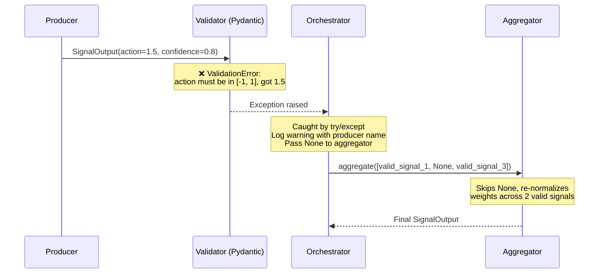

# Option A(b): Signal Contract Enforcement Philosophy

**Parent document**: [Option A(b) Architecture](option_ab_architecture.md)  
**Related**: [Production Readiness](option_ab_production_readiness.md) | [Audience Analysis](option_ab_audience_analysis.md)

---

## Signal Contract Enforcement Philosophy

### The Core Problem

Layer 1 producers are **heterogeneous** — an RL agent, a technical indicator, and an LLM all think in completely different native formats:

| Source Type | Native Output | Problem for Layer 2 |
|---|---|---|
| RL Agent (PPO) | `action ∈ [-1, 1]` (continuous) or `{0, 1, 2}` (discrete) | Discrete actions need mapping to continuous range |
| Technical Indicator | Various: RSI ∈ [0, 100], MACD ∈ (-∞, +∞), Bollinger band % | All different scales, no confidence concept |
| LLM | Free-text or JSON: `"I recommend buying with 70% confidence"` | Unstructured, needs parsing, may hallucinate |
| Rule Engine | Boolean: `True/False` with optional weight | No continuous action, no confidence |

The aggregator (Layer 2) **cannot function** unless every Layer 1 output follows exactly the same format. If one producer returns `action=50` (RSI scale) and another returns `action=0.7` (normalized), the weighted average is meaningless.

### Philosophy: Validate at the Boundary, Not Inside the Aggregator

```
┌─────────────────────────────────────────────────────────────────┐
│                      DESIGN PRINCIPLE                           │
│                                                                 │
│  "Each producer is responsible for translating its native       │
│   output into the universal SignalOutput contract.              │
│   The framework validates the contract at the boundary.         │
│   The aggregator trusts the contract blindly."                  │
│                                                                 │
│  Producer (native format)                                       │
│      ↓                                                          │
│  Producer.produce() — translate + normalize                     │
│      ↓                                                          │
│  ═══ BOUNDARY: validate SignalOutput ═══  ← enforcement here    │
│      ↓                                                          │
│  Aggregator.aggregate() — trusts all inputs are valid           │
│      ↓                                                          │
│  ═══ BOUNDARY: validate final SignalOutput ═══                  │
│      ↓                                                          │
│  Orchestrator                                                   │
└─────────────────────────────────────────────────────────────────┘
```

This means:

1. **The producer owns the translation.** The `RLSignalProducer` knows how to map PPO's discrete `{0, 1, 2}` to `[-1, 0, +1]`. The `TechIndicatorProducer` knows that RSI=30 means `action=-0.4`. The `LLMSignalProducer` parses the LLM's JSON output. None of this logic leaks into the aggregator.

2. **The framework enforces the contract at the boundary.** After `produce()` returns, the orchestrator validates the `SignalOutput` before passing it to the aggregator. If validation fails, the signal is treated as a failure (same as a crash — aggregator gets `None`).

3. **The aggregator trusts blindly.** It never checks ranges, never parses metadata, never handles different scales. It operates purely on `action ∈ [-1, 1]` and `confidence ∈ [0, 1]`.

### Enforced SignalOutput (Pydantic)

Replace the plain `dataclass` with a Pydantic model that validates on construction:

```python
# Trade/signals/signal_types.py
from pydantic import BaseModel, Field, field_validator
from typing import Optional, Dict, Any


class SignalOutput(BaseModel):
    """Enforced contract between Layer 1 producers and Layer 2 aggregator.
    
    This is the ONLY format that crosses the Layer 1 → Layer 2 boundary.
    Validation happens on construction — invalid values raise immediately.
    """
    model_config = {"frozen": True}
    
    signal_name: str = Field(
        ..., 
        description="Unique identifier matching the producer's name"
    )
    action: float = Field(
        ..., 
        ge=-1.0, le=1.0,
        description=(
            "Trading direction and intensity. "
            "-1.0 = strong sell, 0.0 = hold/neutral, +1.0 = strong buy. "
            "Producers MUST normalize their native output to this range."
        )
    )
    confidence: float = Field(
        ..., 
        ge=0.0, le=1.0,
        description=(
            "How confident the producer is in this signal. "
            "0.0 = no confidence (essentially abstaining), "
            "1.0 = maximum confidence. "
            "Used by aggregators for weighting."
        )
    )
    metadata: Optional[Dict[str, Any]] = Field(
        default=None,
        description=(
            "Optional producer-specific metadata. The aggregator does NOT "
            "depend on any key here — this is for logging, debugging, and "
            "the MetaLLMAggregator (which reads it as context, not as contract)."
        )
    )

    @field_validator("action")
    @classmethod
    def clamp_action(cls, v: float) -> float:
        """Hard enforcement: action MUST be in [-1, 1]."""
        if not (-1.0 <= v <= 1.0):
            raise ValueError(
                f"action must be in [-1.0, 1.0], got {v}. "
                f"Producers must normalize their native output."
            )
        return round(v, 6)  # Avoid floating-point noise

    @field_validator("confidence")
    @classmethod
    def clamp_confidence(cls, v: float) -> float:
        """Hard enforcement: confidence MUST be in [0, 1]."""
        if not (0.0 <= v <= 1.0):
            raise ValueError(
                f"confidence must be in [0.0, 1.0], got {v}."
            )
        return round(v, 6)
```

### What Happens When a Producer Returns Bad Data



### Translation Examples (How Each Producer Normalizes)

| Producer | Native Output | → `action` | → `confidence` |
|---|---|---|---|
| **RL (PPO, discrete)** | `action_idx=2` from `{0=sell, 1=hold, 2=buy}` | Map: `{0: -1.0, 1: 0.0, 2: 1.0}` → `1.0` | Derive from value head: `softmax(logits)[action_idx]` → `0.85` |
| **RL (PPO, continuous)** | `action=0.73` already in [-1, 1] | Passthrough: `0.73` | Fixed `0.8` or derive from critic's value estimate |
| **Tech (RSI)** | `RSI=28` (range 0-100) | Linear map: `(28 - 50) / 50` → `-0.44` | `abs(RSI - 50) / 50` → `0.44` (further from neutral = more confident) |
| **Tech (MACD)** | `histogram=0.0035` (unbounded) | `tanh(histogram * scale)` → `0.52` | Based on histogram magnitude relative to ATR |
| **LLM** | `{"action": 0.6, "confidence": 0.7, "reasoning": "..."}` | Parse JSON: `0.6` | Parse JSON: `0.7` |
| **LLM (unstructured)** | `"I'd cautiously buy"` | NLP parse or re-prompt with structured output → `0.3` | Low confidence for unstructured: `0.3` |
| **Rule engine** | `should_buy=True, strength=0.8` | `strength * (1 if buy else -1)` → `0.8` | Fixed per rule or based on how many sub-rules matched |

> [!IMPORTANT]
> **The translation logic lives inside each producer's `produce()` method — never in the aggregator, never in the orchestrator.** This is the single most important design rule. If you find yourself writing `if signal.source == "rsi": normalize(...)` in the aggregator, you've violated the boundary.

### What the Aggregator Sees

By the time signals reach Layer 2, they are **perfectly uniform**:

```python
# What the aggregator receives — no type-specific logic needed
signals = [
    SignalOutput(signal_name="rl_ppo",       action=0.73,  confidence=0.85, metadata={...}),
    SignalOutput(signal_name="tech_rsi",     action=-0.44, confidence=0.44, metadata={...}),
    SignalOutput(signal_name="llm_gemini",   action=0.60,  confidence=0.70, metadata={...}),
]

# The aggregator can be completely generic:
weighted_action = sum(s.action * s.confidence for s in signals) / sum(s.confidence for s in signals)
# = (0.73*0.85 + (-0.44)*0.44 + 0.60*0.70) / (0.85 + 0.44 + 0.70)
# = (0.62 - 0.19 + 0.42) / 1.99
# = 0.427
```

The aggregator doesn't need to know what an RSI is, what a PPO action space looks like, or how to parse LLM output. **That's the philosophy.**

### Metadata: Free-Form but Documented

The `metadata` field is intentionally **unstructured** — it's a `dict` that each producer fills with whatever is useful for debugging, but the standard aggregators (`WeightedVoteAggregator`, `FixedWeightAggregator`) **never read it**.

The one exception: `MetaLLMAggregator` formats metadata into its LLM prompt as human-readable context. But even then, it's best-effort — missing keys don't break anything.

Recommended (not enforced) metadata keys:

| Key | Type | Purpose |
|---|---|---|
| `model_version` | `str` | Which model checkpoint / version produced this |
| `raw_scores` | `dict` | Native scores before normalization (for debugging) |
| `reasoning` | `str` | LLM's reasoning text (for MetaLLMAggregator) |
| `latency_ms` | `float` | How long the producer took |
| `error` | `str` | If the producer partially failed but still returned a signal |

---
