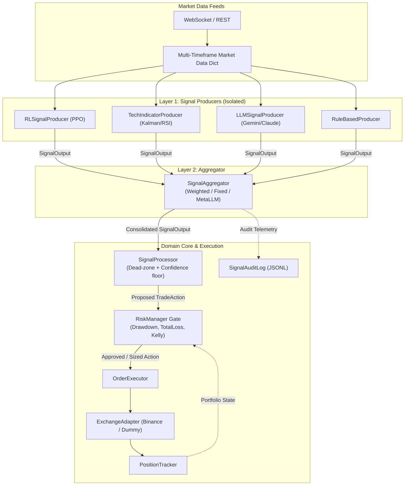

# Architecture Overview — Option A(b)

AI Hedge Finance (AHF) v2 is engineered around **Option A(b): Lightweight 2-Layer Hierarchical Signal Architecture**. It cleanly decouples signal generation, multi-signal aggregation, risk management, and order execution.

---

## 1. High-Level System Topology

---

## 2. Architectural Layers

### Layer 1: Signal Producers (`ahf.signals.producers`)
- **Isolation**: Each producer executes independently with threading timeout protection (`ahf.signals.timeout`).
- **Contract**: All producers return immutable `SignalOutput` objects with action $\in [-1.0, 1.0]$ and confidence $\in [0.0, 1.0]$.
- **Graceful Degradation**: If a model fails or times out, it produces a neutral `HOLD` signal without halting the engine.

### Layer 2: Signal Aggregator (`ahf.signals.aggregators`)
- Combines $N$ producer outputs into 1 consolidated `SignalOutput`.
- Supports dynamic confidence weighting (`WeightedVote`), static weighting (`FixedWeight`), democratic voting (`MajorityVote`), and LLM arbitration (`MetaLLM`).

### Domain Core (`ahf.domain`)
1. **`SignalProcessor`**: Maps continuous signal action $[-1.0, 1.0]$ to discrete `TradeAction` (`BUY`, `HOLD`, `SELL`) using dead-zone thresholds and confidence floors.
2. **`RiskManager`**: Chain of Responsibility applying deterministic risk guardrails. If any rule vetoes, the trade is cancelled. Rules can also downsize order size (`KellyRule`).
3. **`PositionTracker`**: Tracks balance, open positions, unrealized PnL, and high-water mark drawdown. Compatible with both live adapters and RL environment datastores.
4. **`OrderExecutor`**: Translates approved `TradeAction` into concrete exchange orders (`MARKET`, `LIMIT`, `STOP_LOSS`).
5. **`TradeOrchestrator`**: Master loop coordinating one complete step: market data ingest $\rightarrow$ signal generation $\rightarrow$ aggregation $\rightarrow$ risk gate $\rightarrow$ order execution $\rightarrow$ audit logging.

### Adapters (`ahf.adapters`)
- **`ExchangeAdapter` ABC**: Clean interface for exchange operations (`get_price`, `get_balance`, `place_order`, `cancel_order`).
- **`DummyAdapter`**: In-memory simulation with slippage, partial fills, and balance tracking.
- **`BinanceAdapter`**: Production REST/WebSocket adapter for Binance Spot and Futures.
