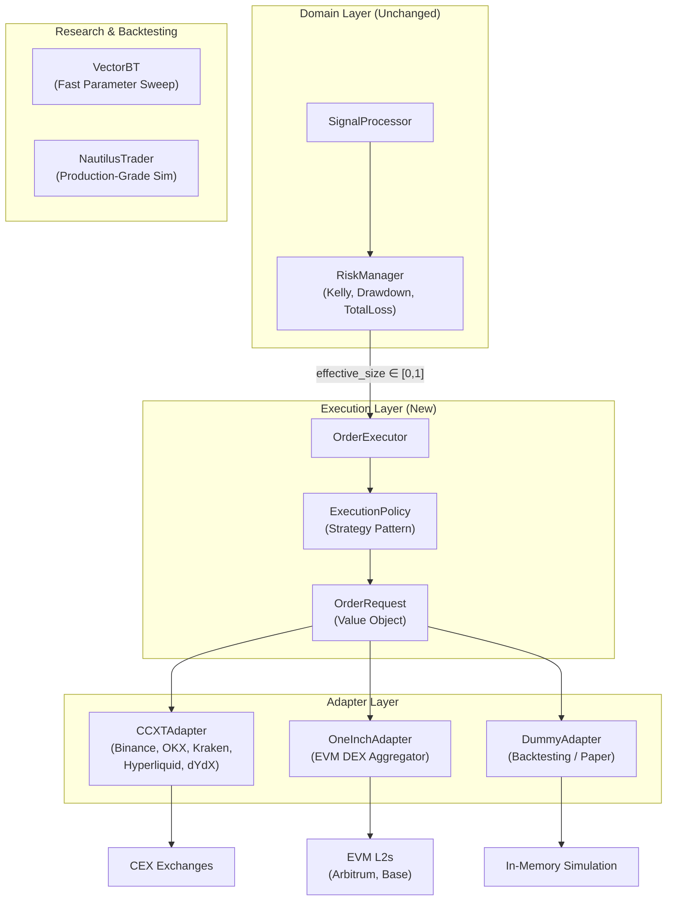

# Proposal: Multi-Venue Execution Architecture

**Author**: AHF Engineering  
**Status**: Draft  
**Date**: 2026-08-17  
**Scope**: Execution layer upgrade — Options 1 & 4 combined, with CCXT, 1inch, VectorBT, and NautilusTrader integration

---

## 1. Problem Statement

AHF v2's execution layer is currently hardcoded for **single-venue cash-spot trading**:

- `OrderExecutor` uses flat arguments (`symbol`, `side`, `quantity`) and embeds spot-specific sizing math (`balance × max_position_fraction × signal_strength`).
- `ExchangeAdapter` has a simple 6-method interface that cannot express venue-specific parameters (slippage tolerance, gas strategy, leverage, margin mode, time-in-force, post-only flags).
- There is no way to support **Perpetual/margin trading** (shorting, leverage), **DEX execution** (on-chain signing, MEV protection, token approvals), or **multi-venue routing** without polluting the domain layer.

The signal pipeline (`SignalProducer` → `SignalAggregator` → `SignalProcessor`) and risk layer (`RiskManager`) are well-designed and venue-agnostic. The gap is strictly in the execution layer.

---

## 2. Design Goals

1. **Support Spot, Perpetual, and DEX execution** through a single domain model.
2. **Keep the risk layer (`ahf.domain.risk`) unchanged** — it operates on normalised portfolio fractions and must not know about venues.
3. **Zero signature churn** — adding a new venue or parameter must not require modifying `OrderExecutor`, `TradeOrchestrator`, or any risk rule.
4. **Preserve RL environment compatibility** — `PositionTracker` dual-path (exchange vs. `rl_env`) must remain intact.
5. **Incremental adoption** — each phase is independently deployable and testable.

---

## 3. Architecture Overview

The proposal combines **Option 1 (Typed `OrderRequest` Value Object)** and **Option 4 (`ExecutionPolicy` Strategy Pattern)** into a unified design.

### 3.1 Data Flow (Current vs. Proposed)

**Current flow** (spot-only, flat arguments):

```
SignalAggregator → SignalProcessor → RiskManager → OrderExecutor.execute(action, signal_strength)
                                                      ↓
                                                    exchange.place_order(symbol, side, quantity)
```

**Proposed flow** (venue-agnostic, structured):

```
SignalAggregator → SignalProcessor → RiskManager → OrderExecutor.execute(action, effective_size)
                                                      ↓
                                                    ExecutionPolicy.size(action, effective_size, portfolio, price)
                                                      ↓
                                                    OrderRequest (typed value object)
                                                      ↓
                                                    ExchangeAdapter.submit(order_request)
```

### 3.2 Component Diagram



---

## 4. Proposed Components

### 4.1 `OrderRequest` — Typed Value Object (Option 1)

A structured, immutable command object that replaces flat `place_order(symbol, side, quantity, ...)` arguments. Carries universal trading semantics plus an extensible params dict for venue-specific overrides.

**Location**: `ahf/domain/order_request.py` (new file)

```python
"""OrderRequest — typed value object for trade instructions."""
from __future__ import annotations
from dataclasses import dataclass, field
from decimal import Decimal
from enum import Enum
from typing import Any


class OrderSide(str, Enum):
    BUY = "BUY"
    SELL = "SELL"


class OrderType(str, Enum):
    MARKET = "MARKET"
    LIMIT = "LIMIT"


class PositionEffect(str, Enum):
    """Disambiguates open vs. close for perpetual/margin venues."""
    OPEN = "OPEN"           # Open Long (BUY) or Open Short (SELL)
    CLOSE = "CLOSE"         # Close Long (SELL) or Close Short (BUY)
    AUTO = "AUTO"           # Let adapter decide (default for spot)


class TimeInForce(str, Enum):
    GTC = "GTC"             # Good-Till-Cancelled
    IOC = "IOC"             # Immediate-Or-Cancel
    FOK = "FOK"             # Fill-Or-Kill
    POST_ONLY = "POST_ONLY"


@dataclass(frozen=True)
class OrderRequest:
    """Immutable trade instruction passed from OrderExecutor to ExchangeAdapter.

    Universal fields cover all venue types. The `params` dict carries
    venue-specific overrides without polluting the core signature.

    Attributes:
        symbol: Trading pair (e.g. "BTCUSDT", "ETHUSDT").
        side: BUY or SELL.
        quantity: Order quantity in base currency units.
        order_type: MARKET or LIMIT.
        limit_price: Required when order_type is LIMIT.
        position_effect: OPEN, CLOSE, or AUTO. Relevant for perps/margin.
            AUTO (default) means: spot venues ignore it; perp venues infer
            from current position state.
        time_in_force: Order time-in-force policy.
        reduce_only: If True, order can only reduce an existing position.
            Enforced by perpetual venues; ignored by spot venues.
        params: Venue-specific execution parameters.
            Examples:
              {"slippage_bps": 50}              — DEX slippage tolerance
              {"leverage": 5, "margin_mode": "isolated"}  — Perp leverage
              {"post_only": True}               — CEX maker-only
              {"gas_priority": "fast"}          — DEX gas strategy
    """
    symbol: str
    side: OrderSide
    quantity: Decimal
    order_type: OrderType = OrderType.MARKET
    limit_price: Decimal | None = None
    position_effect: PositionEffect = PositionEffect.AUTO
    time_in_force: TimeInForce = TimeInForce.GTC
    reduce_only: bool = False
    params: dict[str, Any] = field(default_factory=dict)
```

**Why frozen dataclass**: Immutable after creation, hashable, safe to log and audit. Aligns with the existing `SignalOutput` (frozen Pydantic model) pattern.

---

### 4.2 `ExecutionPolicy` — Strategy Pattern (Option 4)

Translates the RiskManager's normalised `effective_size ∈ [0, 1]` into a concrete `OrderRequest` for the specific instrument and venue type. This is where position scaling happens — **not** in `ahf.domain.risk` and **not** in the adapter.

**Location**: `ahf/domain/execution_policy.py` (new file)

```python
"""ExecutionPolicy ABC and concrete implementations."""
from __future__ import annotations
from abc import ABC, abstractmethod
from decimal import Decimal
from ahf.core.enums import TradeAction
from ahf.domain.order_request import OrderRequest, OrderSide, PositionEffect


class ExecutionPolicy(ABC):
    """Converts (TradeAction, effective_size, portfolio_state) → OrderRequest."""

    @abstractmethod
    def size(
        self,
        action: TradeAction,
        effective_size: float,
        price: Decimal,
        balance: Decimal,
        position: Decimal,
    ) -> OrderRequest | None:
        """Compute the concrete OrderRequest.

        Args:
            action: BUY, SELL, or HOLD (HOLD returns None).
            effective_size: Risk-adjusted size from RiskManager in [0, 1].
            price: Current market price.
            balance: Available cash / margin balance.
            position: Current position in base currency units.

        Returns:
            OrderRequest or None (if order is too small or HOLD).
        """
        ...
```

#### Concrete Policies

| Policy | Behaviour | When to Use |
| :--- | :--- | :--- |
| `SpotCashPolicy` | `quantity = (balance × effective_size × max_fraction) / price` | Current AHF spot trading (Binance, CCXT spot, 1inch) |
| `PerpMarginPolicy` | `quantity = (balance × effective_size × leverage) / price`, sets `position_effect=OPEN/CLOSE` based on current position direction | Perpetual futures (Hyperliquid, dYdX, Binance Futures) |
| `DEXLiquidityPolicy` | Extends `SpotCashPolicy` with pool depth query to cap max order size and set dynamic slippage | 1inch / Jupiter spot swaps |

### 4.3 Position Scaling: Responsibility Boundaries

The three-stage pipeline clarified:

| Stage | Component | Input | Output | What It Decides |
| :--- | :--- | :--- | :--- | :--- |
| **1. Alpha Conviction** | `SignalAggregator` | Market data | `SignalOutput.action ∈ [-1, 1]` | "How strongly do models agree on direction?" |
| **2. Risk Sizing** | `RiskManager` | `proposed_size`, `PortfolioSnapshot` | `effective_size ∈ [0, 1]` | "Given portfolio drawdown and Kelly math, what fraction of capital is safe?" |
| **3. Instrument Sizing** | `ExecutionPolicy` (new) | `effective_size`, `price`, `balance`, `position` | `OrderRequest` with concrete `quantity` | "Given this venue type (spot/perp/DEX), what is the actual base-currency quantity, including leverage and slippage budget?" |
| **4. Exchange Filtering** | `ExchangeAdapter` | `OrderRequest` | Raw API call | "Round quantity to exchange stepSize, enforce minNotional, format API payload" |

> [!IMPORTANT]
> **`ahf.domain.risk` stays unchanged.** It operates on normalised fractions and portfolio snapshots. The `KellyRule`, `MaxDrawdownRule`, and `TotalLossRule` are venue-agnostic by design and require no modifications.

---

### 4.4 `ExchangeAdapter` Interface Update

The existing `ExchangeAdapter` ABC gains one new method while preserving backward compatibility:

```python
# New method on ExchangeAdapter ABC
def submit(self, request: OrderRequest) -> dict:
    """Submit an OrderRequest. Default implementation delegates to place_order().

    Subclasses that need OrderRequest fields (position_effect, params, etc.)
    should override this method directly.
    """
    return self.place_order(
        symbol=request.symbol,
        side=request.side.value,
        quantity=request.quantity,
        order_type=request.order_type.value,
        price=request.limit_price,
    )
```

This default implementation means `DummyAdapter` works without modification. New adapters (CCXT, 1inch) override `submit()` to consume the full `OrderRequest`.

---

### 4.5 `OrderExecutor` Refactoring

`OrderExecutor` is refactored to delegate sizing to the injected `ExecutionPolicy`:

```python
class OrderExecutor:
    def __init__(
        self,
        exchange: ExchangeAdapter,
        symbol: str,
        policy: ExecutionPolicy,        # NEW: injected strategy
        quantity_precision: int = 5,
    ) -> None:
        self._exchange = exchange
        self._symbol = symbol
        self._policy = policy
        self._quantity_precision = quantity_precision

    def execute(self, action: TradeAction, signal_strength: float) -> dict | None:
        if action == TradeAction.HOLD:
            return None

        price = self._exchange.get_price(self._symbol)
        balance = self._exchange.get_balance()
        position = self._exchange.get_position(self._symbol)

        if price <= Decimal("0"):
            logger.error("Invalid price — skipping order")
            return None

        # Delegate sizing to the execution policy
        request = self._policy.size(action, signal_strength, price, balance, position)
        if request is None:
            return None

        return self._exchange.submit(request)
```

**Key change**: The `_execute_buy()` and `_execute_sell()` private methods are removed. All sizing logic moves into `ExecutionPolicy`, making `OrderExecutor` a thin coordinator.

---

## 5. Library Integration Plan

### 5.1 CCXT — Universal CEX & On-Chain CLOB Adapter

**Purpose**: Single adapter covering 100+ centralised exchanges AND on-chain CLOBs (Hyperliquid, dYdX via CCXT unified interface).

**Location**: `ahf/adapters/exchange/ccxt_adapter.py`

**Implementation**:
- Constructor receives `exchange_id` (e.g. `"binance"`, `"hyperliquid"`, `"okx"`), API credentials, and static execution config (testnet flag, default leverage).
- `submit(OrderRequest)` maps the typed request to CCXT's `create_order()` with full support for:
  - Spot: `defaultType="spot"`, ignores `position_effect` and `leverage`.
  - Perpetuals: `defaultType="swap"`, applies `leverage`, `position_effect` → `reduce_only` flag, and `margin_mode`.
- `get_balance()`, `get_position()`, `get_price()` delegate to CCXT's unified methods.

**Spot + Perpetual support**: Yes, via CCXT's `defaultType` and exchange-specific params.

**Dependency**: `ccxt>=4.0` (add to `[project.optional-dependencies.exchange]`)

---

### 5.2 1inch — EVM DEX Spot Aggregator

**Purpose**: Best-execution spot swaps across EVM L2s (Arbitrum, Base, Optimism, Ethereum).

**Location**: `ahf/adapters/exchange/oneinch_adapter.py`

**Implementation**:
- Constructor receives chain ID, RPC URL, wallet private key (from env), default slippage, and gas strategy.
- `submit(OrderRequest)` maps the request to 1inch Swap API v6 (or Fusion API for gasless MEV-protected execution).
- `get_balance()` / `get_position()` read ERC-20 token balances via `web3.py`.
- `get_price()` queries 1inch Quote API.

**Spot + Perpetual support**: Spot only. Perpetuals require a separate adapter (Hyperliquid via CCXT).

**Dependencies**: `web3>=7.0`, `httpx>=0.27` (add to new `[project.optional-dependencies.dex]` group)

> [!WARNING]
> **MEV & Token Approvals**: The adapter's `__init__` must check token allowances on the 1inch Router contract and trigger an `approve()` transaction if insufficient. For MEV protection, prefer `use_fusion=True` (gasless intent-based execution) or route transactions through private RPCs (Flashbots Protect).

---

### 5.3 VectorBT — Fast Research & Parameter Sweep

**Purpose**: Numba-accelerated vectorized backtesting for rapid alpha research, ensemble weight tuning, and ExecutionPolicy parameter optimisation.

**Location**: `ahf/entrypoints/research.py` (new entrypoint)

**How it integrates with AHF**:
- Does **not** replace the tick-by-tick `TradeOrchestrator` backtest. VectorBT operates on pre-computed signal arrays, not live pipelines.
- Workflow:
  1. Run AHF pipeline in replay mode → produce a DataFrame of `(timestamp, signal_action, signal_confidence)` per producer.
  2. Feed signal arrays into VectorBT `Portfolio.from_signals()` with custom sizing functions.
  3. Sweep thousands of parameter combinations (Kelly fractions, aggregator weights, buy/sell thresholds) in seconds.
  4. Export optimal parameters back into AHF pipeline config JSON.

**Spot + Perpetual support**: Yes. VectorBT supports `direction="both"` (long/short), leverage multipliers, and funding rate deductions.

**Dependency**: `vectorbt>=0.26` or `vectorbtpro` (add to new `[project.optional-dependencies.research]` group)

---

### 5.4 NautilusTrader — Production-Grade Simulation

**Purpose**: High-fidelity event-driven backtesting with realistic order matching, L2 book simulation, latency modelling, and multi-asset portfolio tracking.

**Location**: `ahf/adapters/backtest/nautilus_engine.py` (new module)

**How it integrates with AHF**:
- AHF signal pipeline runs as a NautilusTrader `Actor` or `Strategy` subclass.
- The Actor's `on_bar()` callback calls `TradeOrchestrator.step()` with market data from Nautilus' data engine.
- Orders produced by `OrderExecutor` are submitted to Nautilus' simulated matching engine instead of a live exchange.
- Benefits: Realistic partial fills, queue priority simulation, tick-level slippage modelling, and multi-instrument portfolio tracking.

**Spot + Perpetual support**: Yes. Nautilus natively supports `AccountType.CASH` (spot) and `AccountType.MARGIN` (perps/futures) with full margin and leverage accounting.

**Dependency**: `nautilus_trader>=1.200` (add to `[project.optional-dependencies.research]` group)

> [!NOTE]
> NautilusTrader is a **simulation and backtesting engine**, not a live exchange connector (though it can connect to live venues via adapters). For AHF, its primary value is production-grade backtesting that validates execution mechanics before deploying to live CCXT/1inch adapters.

---

## 6. `pyproject.toml` Changes

```toml
[project.optional-dependencies]
exchange = [
    "python-binance>=1.0.19",
    "ccxt>=4.0",                  # NEW: universal CEX + on-chain CLOB
    "redis>=5.0",
    "schedule>=1.2",
    "requests>=2.31",
]
dex = [                           # NEW: on-chain DEX execution
    "web3>=7.0",
    "httpx>=0.27",
    "eth-account>=0.13",
]
research = [                      # NEW: backtesting & optimisation
    "vectorbt>=0.26",
    "nautilus_trader>=1.200",
]
```

---

## 7. Configuration & Settings

New fields in `AHFSettings`:

```python
# Execution policy
execution_policy: str = "spot_cash"     # "spot_cash" | "perp_margin" | "dex_liquidity"
default_leverage: float = 1.0           # Only used by perp_margin policy

# Exchange adapter
exchange_adapter: str = "dummy"         # "dummy" | "ccxt" | "oneinch"
ccxt_exchange_id: str = "binance"       # CCXT exchange identifier
ccxt_testnet: bool = True

# DEX-specific
chain_id: int = 42161                   # Arbitrum by default
rpc_url: str = ""
max_slippage_bps: int = 50              # 0.5% default slippage for DEX
use_fusion: bool = True                 # 1inch Fusion (gasless, MEV-protected)
```

New `.env.example` entries (credentials loaded from environment, never hardcoded):

```env
# CCXT
CCXT_API_KEY=
CCXT_API_SECRET=
CCXT_PASSPHRASE=

# DEX / On-Chain
WALLET_PRIVATE_KEY=
RPC_URL=
ONEINCH_API_KEY=
```

---

## 8. Impact Analysis

### What Changes

| Component | Change Type | Details |
| :--- | :---: | :--- |
| `order_executor.py` | **Refactor** | Remove `_execute_buy()` / `_execute_sell()`. Inject `ExecutionPolicy`. Call `policy.size()` → `exchange.submit()`. |
| `exchange_adapter.py` | **Extend** | Add `submit(OrderRequest)` method with default delegation to `place_order()`. |
| `trade.py` | **Extend** | Wire up `ExecutionPolicy` and adapter selection from `AHFSettings`. |
| `settings.py` | **Extend** | Add execution policy, adapter, and DEX configuration fields. |

### What Does NOT Change

| Component | Reason |
| :--- | :--- |
| `RiskManager` + all risk rules | Operates on normalised fractions — venue-agnostic by design. |
| `SignalProducer` / `SignalAggregator` / `SignalOutput` | Signal pipeline is decoupled from execution. |
| `TradeOrchestrator` | Calls `OrderExecutor.execute()` — signature unchanged. |
| `PositionTracker` | Reads state from `ExchangeAdapter` — interface preserved. |
| `DummyAdapter` | Inherits default `submit()` → `place_order()` delegation. Zero changes. |
| Pipeline configs (`configs/pipeline.*.json`) | Signal pipeline is orthogonal to execution. |
| RL environment integration | `PositionTracker` dual-path (`exchange` vs. `rl_env`) is unaffected. |

---

## 9. Phased Implementation Plan

### Phase 1: Core Abstractions (Week 1)

| Task | Deliverable |
| :--- | :--- |
| Define `OrderRequest` value object | `ahf/domain/order_request.py` |
| Define `ExecutionPolicy` ABC + `SpotCashPolicy` | `ahf/domain/execution_policy.py` |
| Add `submit(OrderRequest)` to `ExchangeAdapter` with default delegation | Modify `exchange_adapter.py` |
| Refactor `OrderExecutor` to use `ExecutionPolicy` | Modify `order_executor.py` |
| Update `trade.py` composition root to inject `SpotCashPolicy` | Modify `trade.py` |
| Update existing tests to pass with refactored `OrderExecutor` | Modify `tests/` |

**Verification**: All existing tests pass. `DummyAdapter` works unchanged. Behaviour is identical to current code.

### Phase 2: CCXT Adapter (Week 2)

| Task | Deliverable |
| :--- | :--- |
| Implement `CCXTAdapter` with `submit(OrderRequest)` | `ahf/adapters/exchange/ccxt_adapter.py` |
| Add CCXT to `pyproject.toml` exchange extras | Modify `pyproject.toml` |
| Add `AHFSettings` fields for adapter selection | Modify `settings.py` |
| Wire CCXT adapter into `trade.py` composition root | Modify `trade.py` |
| Integration test with Binance testnet | `tests/integration/test_ccxt_adapter.py` |

**Verification**: Paper trade on Binance testnet using `AHF_EXCHANGE_ADAPTER=ccxt AHF_CCXT_TESTNET=true`.

### Phase 3: Perpetual Support (Week 3)

| Task | Deliverable |
| :--- | :--- |
| Implement `PerpMarginPolicy` | Extend `execution_policy.py` |
| Extend `CCXTAdapter.submit()` for futures (leverage, position_effect, reduce_only) | Modify `ccxt_adapter.py` |
| Extend `PortfolioSnapshot` with `leverage` and `margin_used` fields (additive, non-breaking) | Modify `risk_types.py` |
| Add Hyperliquid integration test via CCXT | `tests/integration/test_hyperliquid.py` |

**Verification**: Paper trade perpetuals on Hyperliquid testnet.

### Phase 4: DEX / 1inch Adapter (Week 4)

| Task | Deliverable |
| :--- | :--- |
| Implement `OneInchAdapter` with `submit(OrderRequest)` | `ahf/adapters/exchange/oneinch_adapter.py` |
| Implement `DEXLiquidityPolicy` (slippage-aware sizing) | Extend `execution_policy.py` |
| Add `dex` extras to `pyproject.toml` | Modify `pyproject.toml` |
| Token approval management in adapter `__init__` | Part of `oneinch_adapter.py` |
| Integration test on Arbitrum testnet | `tests/integration/test_oneinch_adapter.py` |

**Verification**: Execute a test swap on Arbitrum Sepolia testnet.

### Phase 5: Research Tooling (Week 5)

| Task | Deliverable |
| :--- | :--- |
| VectorBT research entrypoint with signal replay → parameter sweep | `ahf/entrypoints/research.py` |
| NautilusTrader backtest engine wrapping AHF orchestrator | `ahf/adapters/backtest/nautilus_engine.py` |
| Add `research` extras to `pyproject.toml` | Modify `pyproject.toml` |

**Verification**: Run VectorBT sweep on historical signal audit logs. Run NautilusTrader backtest with realistic fill simulation.

---

## 10. File Structure (Final State)

```
src/ahf/
├── adapters/
│   ├── backtest/
│   │   └── nautilus_engine.py          # Phase 5: NautilusTrader integration
│   ├── exchange/
│   │   ├── exchange_adapter.py         # Phase 1: + submit(OrderRequest)
│   │   ├── dummy_adapter.py            # Unchanged (inherits default submit)
│   │   ├── ccxt_adapter.py             # Phase 2: CCXT universal adapter
│   │   └── oneinch_adapter.py          # Phase 4: 1inch DEX adapter
│   └── ...
├── domain/
│   ├── order_request.py                # Phase 1: OrderRequest value object
│   ├── execution_policy.py             # Phase 1: ExecutionPolicy ABC + SpotCashPolicy
│   │                                   # Phase 3: + PerpMarginPolicy
│   │                                   # Phase 4: + DEXLiquidityPolicy
│   ├── order_executor.py               # Phase 1: Refactored to use ExecutionPolicy
│   ├── trade_orchestrator.py           # Unchanged
│   ├── signal_processor.py             # Unchanged
│   ├── position_tracker.py             # Unchanged
│   └── risk/                           # Unchanged
│       ├── risk_manager.py
│       ├── risk_rule.py
│       ├── risk_types.py
│       ├── kelly_rule.py
│       ├── drawdown_rule.py
│       └── total_loss_rule.py
├── entrypoints/
│   ├── trade.py                        # Phase 1-4: Updated composition root
│   ├── research.py                     # Phase 5: VectorBT + Nautilus entrypoint
│   └── ...
└── signals/                            # Unchanged (entire pipeline)
```

---

## 11. Risk Assessment

| Risk | Likelihood | Impact | Mitigation |
| :--- | :---: | :---: | :--- |
| `OrderExecutor` refactor breaks existing tests | Medium | Low | Phase 1 `SpotCashPolicy` replicates exact current behaviour. Run full test suite before merging. |
| CCXT API changes break adapter | Low | Medium | Pin CCXT version. CCXT has stable unified API since v4. |
| 1inch API rate limits / downtime | Medium | Medium | Implement retry with exponential backoff. Cache quotes for short TTL. |
| MEV sandwich attacks on DEX swaps | High | High | Default to `use_fusion=True` (gasless, MEV-protected). Document private RPC fallback. |
| NautilusTrader heavy dependency footprint | Low | Low | Isolated in `research` optional extras. Not required for live trading. |

---

## 12. Open Questions

1. **Multi-symbol support**: The current architecture is single-symbol (`AHFSettings.symbol`). Should `OrderRequest` and `ExecutionPolicy` support multi-asset portfolio rebalancing, or is single-symbol sufficient for the near term?

2. **Async execution**: DEX transactions are inherently asynchronous (broadcast → wait for block inclusion). Should `ExchangeAdapter.submit()` return a `Future` / use `async/await`, or should the adapter block until confirmation? Blocking is simpler but ties up the main loop.

3. **Hyperliquid via CCXT vs. native SDK**: Hyperliquid is supported in CCXT, but the native `hyperliquid-python-sdk` offers lower-level vault management and sub-account features. Is the CCXT abstraction sufficient, or do we need a dedicated `HyperliquidAdapter`?
